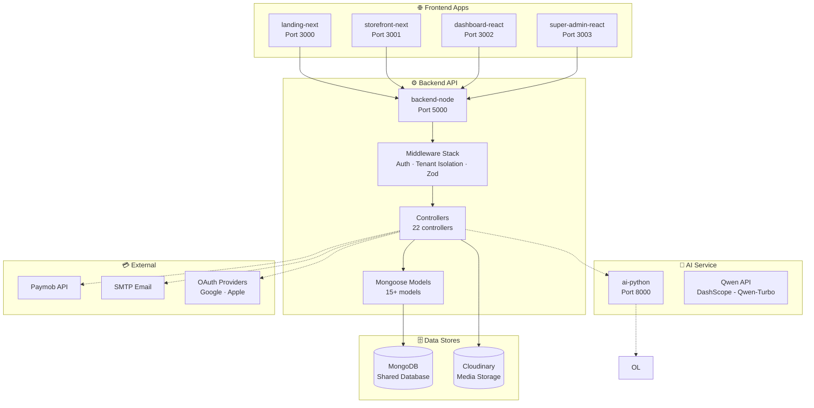
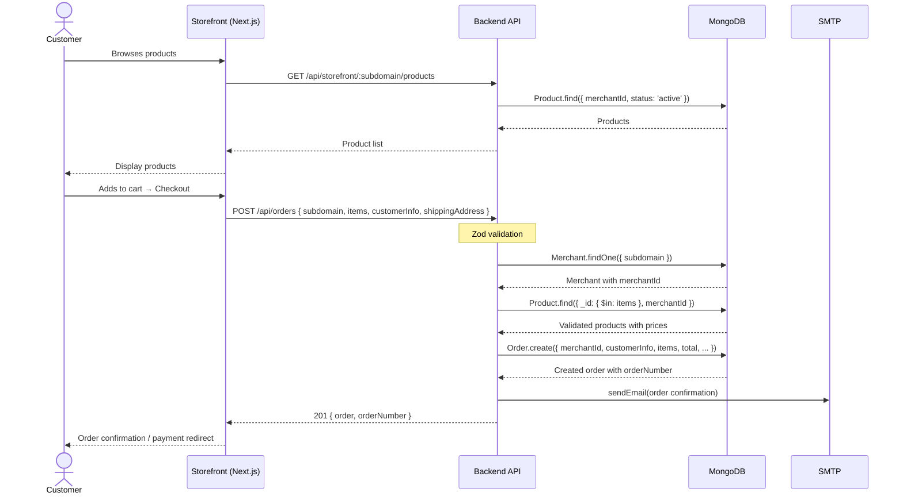
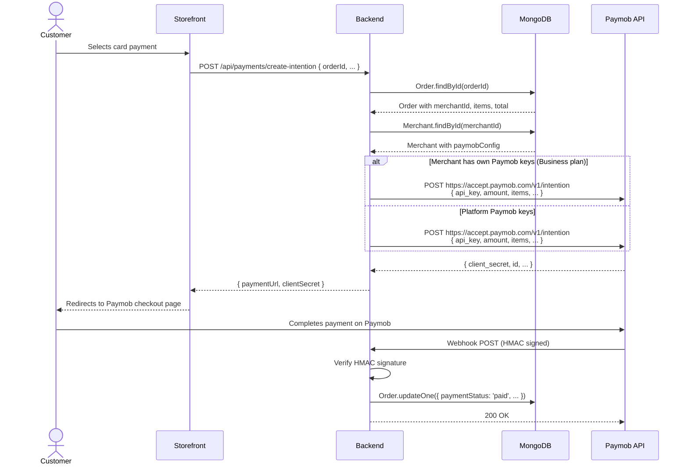
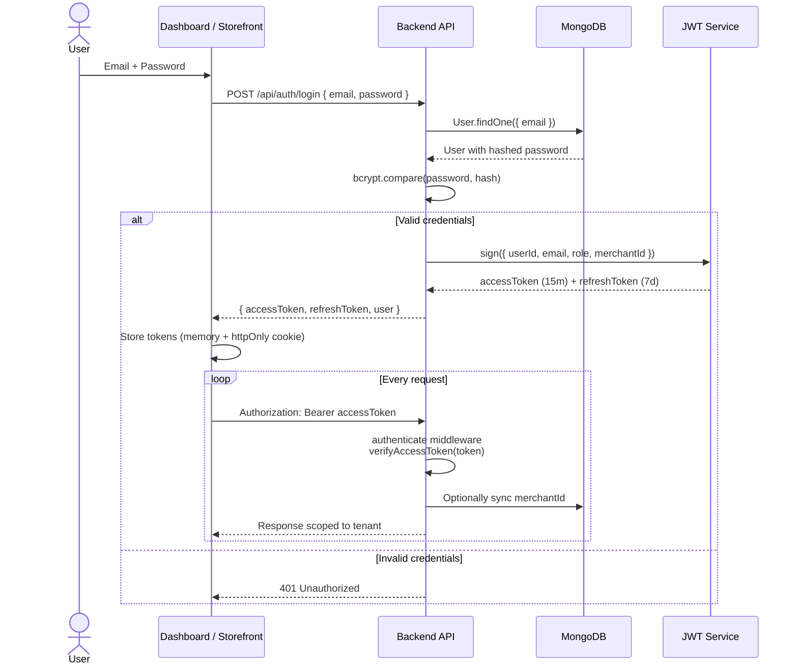

# Matgarco - Complete Project Documentation

**Version:** 2.0  
**Date:** March 17, 2026  
**Status:** Phase 6 (AI Features) Complete — Phase 4 (Payment) Next

---

## 📑 Table of Contents

1. [Project Overview](#1-project-overview)
2. [Tech Stack](#2-tech-stack)
3. [System Architecture](#3-system-architecture)
4. [Database Schema](#4-database-schema)
5. [API Endpoints](#5-api-endpoints)
6. [Project Structure](#6-project-structure)
7. [Features Breakdown](#7-features-breakdown)
8. [Subscription Plans](#8-subscription-plans)
9. [Payment & Shipping Model](#9-payment--shipping-model)
10. [AI Capabilities](#10-ai-capabilities)
11. [Development Roadmap](#11-development-roadmap)
12. [Deployment Strategy](#12-deployment-strategy)
13. [Security & Best Practices](#13-security--best-practices)
14. [Development Notes](#14-development-notes)

---

## 1. Project Overview

### What is Matgarco?

**Matgarco** is a Multi-Tenant SaaS E-commerce Platform that allows merchants to create and manage their own online stores with custom subdomains, AI-powered tools, and flexible subscription plans.

### Core Concept

- **One Platform** → Multiple Independent Stores
- **Each Merchant** → Own Subdomain (`merchant.matgarco.com`)
- **Each Store** → Custom Design, Products, Orders
- **Centralized System** → One codebase, shared infrastructure

### Target Users

1. **Merchants** - Business owners who want online stores
2. **Customers** - End users who buy from stores
3. **Super Admin** - Platform owners (You)

### Key Value Propositions

- ✅ Quick store setup (< 10 minutes)
- ✅ No technical knowledge required
- ✅ AI-powered content generation
- ✅ Affordable pricing (starting 250 EGP/month)
- ✅ Egyptian payment gateway integration
- ✅ Mobile-responsive stores

---

## 2. Tech Stack

### Frontend

| Component              | Technology            | Version | Reason                         |
| ---------------------- | --------------------- | ------- | ------------------------------ |
| **Landing Page**       | Next.js (App Router)  | 14.x    | SEO, Static pages, Marketing   |
| **Storefront**         | Next.js (App Router)  | 14.x    | SEO, Dynamic routing, PWA      |
| **Merchant Dashboard** | React.js (SPA)        | 18.x    | Complex UI, Charts, Real-time  |
| **Super Admin**        | React.js (SPA)        | 18.x    | Internal tool, Heavy data      |
| **Language**           | TypeScript            | 5.x     | Type safety, Better DX         |
| **Styling**            | Tailwind CSS          | 3.x     | Rapid development, Consistency |
| **State Management**   | Zustand / React Query | Latest  | Simple, Efficient              |
| **Charts**             | Recharts              | Latest  | Dashboard analytics            |

### Backend

| Component          | Technology           | Version  | Reason                          |
| ------------------ | -------------------- | -------- | ------------------------------- |
| **Runtime**        | Node.js              | 20.x LTS | Stable, Wide support            |
| **Framework**      | Express.js           | 4.x      | Simple, Flexible, Battle-tested |
| **Language**       | TypeScript           | 5.x      | Type safety across stack        |
| **Database**       | MongoDB              | 7.x      | Document-based, Flexible schema |
| **ODM**            | Mongoose             | Latest   | Schema validation, Middleware   |
| **Authentication** | JWT + Refresh Tokens | -        | Stateless, Scalable             |
| **Validation**     | Zod                  | Latest   | TypeScript-first validation     |
| **File Upload**    | Multer               | Latest   | Handling images                 |
| **Email**          | Nodemailer           | Latest   | Verification, Reset password    |

### AI Service

| Component     | Technology        | Reason                      |
| ------------- | ----------------- | --------------------------- |
| **Runtime**   | Python            | 3.11+                       |
| **Framework** | FastAPI           | Fast, Async, Auto docs      |
| **AI Models** | Qwen (DashScope)  | Arabic support, Fast, Reliable |
| **Models**    | Qwen-Turbo        | All AI features              |
| **Image**     | Pillow            | Image optimization          |

### Storage & Media

| Service           | Purpose                  | Plan                     |
| ----------------- | ------------------------ | ------------------------ |
| **Cloudinary**    | Images (products, logos) | Free tier (25GB)         |
| **MongoDB Atlas** | Database hosting         | Free tier (512MB) → Paid |

### Deployment

| Component                | Platform                    | Cost             |
| ------------------------ | --------------------------- | ---------------- |
| **Landing + Storefront** | Vercel                      | Free tier → Pro  |
| **Backend API**          | Railway / Render            | Free tier → Paid |
| **AI Service**           | Your local server / Railway | Free initially   |
| **Database**             | MongoDB Atlas               | Free → Paid      |

---

## 3. System Architecture

### High-Level Architecture

```
┌─────────────────────────────────────────────────────────┐
│                    Internet / Users                      │
└────────────┬────────────────────────────────────────────┘
             │
             ├──────────────────────────────────────────┐
             │                                          │
             ▼                                          ▼
    ┌─────────────────┐                      ┌──────────────────┐
    │  Landing Page   │                      │   Storefront     │
    │  (Next.js)      │                      │   (Next.js)      │
    │  matgarco.com   │                      │ merchant.matgarco│
    └────────┬────────┘                      └────────┬─────────┘
             │                                        │
             │                                        │
             ├────────────────┬───────────────────────┤
             │                │                       │
             ▼                ▼                       ▼
    ┌─────────────┐  ┌──────────────┐     ┌─────────────────┐
    │  Merchant   │  │ Super Admin  │     │   REST API      │
    │  Dashboard  │  │  Dashboard   │     │   (Express.js)  │
    │  (React)    │  │  (React)     │     │   + JWT Auth    │
    └──────┬──────┘  └──────┬───────┘     └────────┬────────┘
           │                │                       │
           └────────────────┴───────────────────────┤
                                                    │
                         ┌──────────────────────────┴──────┐
                         │                                 │
                         ▼                                 ▼
                 ┌───────────────┐              ┌──────────────────┐
                 │   MongoDB     │              │   AI Service     │
                 │   (Atlas)     │              │   (FastAPI)      │
                 │               │              │   + Qwen API     │
                 └───────┬───────┘              └──────────────────┘
                         │
                         ▼
                 ┌───────────────┐
                 │  Cloudinary   │
                 │  (Images)     │
                 └───────────────┘
```

### Multi-Tenant Strategy

**Approach:** Single Database + Shared Collections + Tenant Isolation

#### How it Works:

1. **Every document has `merchantId`**
2. **API queries filter by `merchantId`**
3. **JWT contains `merchantId` for auth**
4. **Subdomain mapping to merchant**

#### Example:

```javascript
// Merchant A uploads product
{
  _id: "prod_123",
  merchantId: "merchant_a",
  name: "T-Shirt",
  price: 299
}

// Merchant B uploads product
{
  _id: "prod_456",
  merchantId: "merchant_b",
  name: "Laptop",
  price: 15000
}

// Query: Only returns products for Merchant A
Product.find({ merchantId: req.user.merchantId })
```

### Subdomain Routing

#### Domain Structure:

| Type      | Domain                   | Purpose             |
| --------- | ------------------------ | ------------------- |
| Landing   | `matgarco.com`           | Marketing, Sign up  |
| Store     | `merchant.matgarco.com`  | Customer shopping   |
| Dashboard | `dashboard.matgarco.com` | Merchant management |
| Admin     | `admin.matgarco.com`     | Super admin         |

#### How Subdomains Work:

1. **DNS Setup:** Wildcard record `*.matgarco.com` → Server IP
2. **Backend Detection:**
   ```javascript
   const subdomain = req.hostname.split(".")[0];
   const merchant = await Merchant.findOne({ subdomain });
   ```
3. **Frontend Routing:** Next.js middleware checks subdomain

---

## 4. Database Schema

### Collections Overview

1. **users** - All system users (merchants, customers, admins)
2. **merchants** - Store/merchant data
3. **products** - Product catalog
4. **orders** - Order transactions
5. **customers** - Customer profiles
6. **subscriptions** - Subscription plans & billing
7. **templates** - Store themes/templates
8. **storeConfigs** - Store customization settings
9. **reviews** - Product reviews
10. **analytics** - Store analytics data
11. **aiUsage** - AI feature usage tracking

---

### 4.1 Users Collection

```typescript
{
  _id: ObjectId,
  email: string, // unique, indexed
  password: string, // bcrypt hashed
  role: "super_admin" | "merchant_owner" | "merchant_staff" | "customer",

  // Profile
  firstName: string,
  lastName: string,
  phone?: string,
  avatar?: string,

  // Relations
  merchantId?: ObjectId, // if merchant/staff

  // Auth
  emailVerified: boolean,
  verificationToken?: string,
  resetPasswordToken?: string,
  resetPasswordExpires?: Date,
  refreshToken?: string,

  // OAuth
  googleId?: string,
  facebookId?: string,

  // Meta
  lastLogin?: Date,
  isActive: boolean,
  createdAt: Date,
  updatedAt: Date
}
```

**Indexes:**

- `email` (unique)
- `role`
- `merchantId`

---

### 4.2 Merchants Collection

```typescript
{
  _id: ObjectId,

  // Store Identity
  storeName: string, // "Tech Shop"
  subdomain: string, // "techshop" → techshop.matgarco.com (unique, indexed)
  customDomain?: string, // "shop.example.com"

  // Business Info
  businessName?: string,
  businessType?: string, // "retail", "wholesale", "services"
  description?: string,
  logo?: string, // Cloudinary URL

  // Contact
  email: string,
  phone?: string,
  address?: {
    street: string,
    city: string,
    state: string,
    country: string,
    postalCode: string
  },

  // Owner
  ownerId: ObjectId, // ref: users

  // Subscription
  subscriptionPlan: "free_trial" | "starter" | "professional" | "business",
  subscriptionStatus: "active" | "expired" | "suspended" | "cancelled",
  subscriptionStartDate: Date,
  subscriptionEndDate: Date,
  trialEndsAt?: Date,

  // Settings
  currency: string, // "EGP", "USD"
  language: string, // "ar", "en"
  timezone: string,

  // Store Config
  templateId: ObjectId, // ref: templates

  // Features Limits (based on plan)
  limits: {
    maxProducts: number,
    maxStaffUsers: number,
    aiCreditsPerMonth: number,
    aiCreditsUsed: number
  },

  // Stats
  stats: {
    totalOrders: number,
    totalRevenue: number,
    totalProducts: number,
    totalCustomers: number
  },

  // Status
  isActive: boolean,
  suspensionReason?: string,

  // Meta
  onboardingCompleted: boolean,
  createdAt: Date,
  updatedAt: Date
}
```

**Indexes:**

- `subdomain` (unique)
- `ownerId`
- `subscriptionStatus`
- `createdAt`

---

### 4.3 Products Collection

```typescript
{
  _id: ObjectId,
  merchantId: ObjectId, // indexed

  // Basic Info
  name: string,
  slug: string, // URL-friendly (indexed with merchantId)
  description: string,
  shortDescription?: string,

  // Pricing
  price: number,
  compareAtPrice?: number, // Original price for discounts
  costPerItem?: number, // For profit tracking

  // Inventory
  sku?: string,
  barcode?: string,
  trackQuantity: boolean,
  quantity?: number,
  lowStockThreshold?: number,

  // Media
  images: [
    {
      url: string, // Cloudinary
      alt?: string,
      isPrimary: boolean
    }
  ],

  // Organization
  category?: string,
  tags?: string[],

  // Variants (e.g., sizes, colors)
  hasVariants: boolean,
  variants?: [
    {
      _id: ObjectId,
      name: string, // "Large / Red"
      sku?: string,
      price?: number,
      quantity?: number,
      attributes: {
        size?: string,
        color?: string,
        // ... other attributes
      }
    }
  ],

  // SEO
  seo: {
    title?: string,
    description?: string,
    keywords?: string[]
  },

  // Status
  status: "draft" | "active" | "archived",
  isVisible: boolean,
  isFeatured: boolean,

  // AI Generated
  aiGenerated: {
    description: boolean,
    seo: boolean
  },

  // Stats
  views: number,
  sales: number,
  averageRating?: number,
  reviewCount: number,

  // Meta
  createdAt: Date,
  updatedAt: Date
}
```

**Indexes:**

- `merchantId`
- `merchantId + slug` (compound, unique)
- `status`
- `isFeatured`
- `category`

---

### 4.4 Orders Collection

```typescript
{
  _id: ObjectId,
  merchantId: ObjectId, // indexed
  orderNumber: string, // "ORD-2026-0001" (unique)

  // Customer
  customerId?: ObjectId, // ref: users (null for guest)
  customerInfo: {
    email: string,
    firstName: string,
    lastName: string,
    phone: string
  },

  // Items
  items: [
    {
      productId: ObjectId,
      productName: string,
      productImage?: string,
      variantId?: ObjectId,
      variantName?: string,
      quantity: number,
      price: number, // Price at time of purchase
      subtotal: number
    }
  ],

  // Pricing
  subtotal: number,
  tax: number,
  shippingCost: number,
  discount: number,
  total: number,

  // Shipping Address
  shippingAddress: {
    firstName: string,
    lastName: string,
    phone: string,
    street: string,
    city: string,
    state: string,
    country: string,
    postalCode: string
  },

  // Billing (can be same as shipping)
  billingAddress?: { /* same structure */ },

  // Status
  orderStatus: "pending" | "confirmed" | "processing" | "shipped" | "delivered" | "cancelled" | "refunded",
  paymentStatus: "pending" | "paid" | "failed" | "refunded",
  fulfillmentStatus: "unfulfilled" | "partial" | "fulfilled",

  // Payment
  paymentMethod: "cash" | "card" | "paymob" | "wallet",
  paymentGateway?: string,
  paymentTransactionId?: string,

  // Platform Commission (for Starter plan)
  platformCommission: {
    percentage: number,
    amount: number
  },

  // Shipping
  shippingMethod?: string,
  trackingNumber?: string,
  shippingProvider?: string,

  // Notes
  customerNotes?: string,
  merchantNotes?: string,

  // Timeline
  timeline: [
    {
      status: string,
      timestamp: Date,
      note?: string
    }
  ],

  // Meta
  createdAt: Date,
  updatedAt: Date
}
```

**Indexes:**

- `merchantId`
- `orderNumber` (unique)
- `customerId`
- `orderStatus`
- `createdAt`

---

### 4.5 Customers Collection

```typescript
{
  _id: ObjectId,
  merchantId: ObjectId, // indexed
  userId?: ObjectId, // ref: users (if registered)

  // Basic Info
  email: string,
  firstName: string,
  lastName: string,
  phone?: string,

  // Addresses (saved for quick checkout)
  addresses: [
    {
      _id: ObjectId,
      label: string, // "Home", "Work"
      isDefault: boolean,
      street: string,
      city: string,
      state: string,
      country: string,
      postalCode: string
    }
  ],

  // Stats
  stats: {
    totalOrders: number,
    totalSpent: number,
    averageOrderValue: number,
    lastOrderDate?: Date
  },

  // Marketing
  acceptsMarketing: boolean,

  // Meta
  createdAt: Date,
  updatedAt: Date
}
```

**Indexes:**

- `merchantId`
- `merchantId + email` (compound)
- `userId`

---

### 4.6 Subscriptions Collection

```typescript
{
  _id: ObjectId,
  merchantId: ObjectId, // indexed

  // Plan Details
  plan: "free_trial" | "starter" | "professional" | "business",
  billingCycle: "monthly" | "annual",

  // Pricing
  amount: number, // in EGP
  currency: "EGP",
  commissionRate?: number, // for Starter plan (2%)

  // Period
  startDate: Date,
  endDate: Date,

  // Status
  status: "active" | "cancelled" | "expired" | "suspended",
  autoRenew: boolean,

  // Payment
  paymentMethod?: string,
  lastPaymentDate?: Date,
  nextBillingDate?: Date,

  // Invoices
  invoices: [
    {
      _id: ObjectId,
      invoiceNumber: string,
      amount: number,
      status: "paid" | "pending" | "failed",
      paidAt?: Date,
      receiptUrl?: string
    }
  ],

  // Trial
  isTrialPeriod: boolean,
  trialEndsAt?: Date,

  // Cancellation
  cancelledAt?: Date,
  cancellationReason?: string,

  // Meta
  createdAt: Date,
  updatedAt: Date
}
```

**Indexes:**

- `merchantId`
- `status`
- `nextBillingDate`

---

### 4.7 Templates Collection

```typescript
{
  _id: ObjectId,

  // Template Info
  name: string, // "Modern Store"
  slug: string, // "modern-store"
  description: string,

  // Preview
  thumbnail: string, // Screenshot
  demoUrl?: string,

  // Type
  type: "modern" | "minimal" | "luxury",

  // Default Config
  defaultConfig: {
    colors: {
      primary: string, // "#000000"
      secondary: string,
      accent: string,
      background: string,
      text: string
    },
    fonts: {
      heading: string, // "Poppins"
      body: string // "Inter"
    },
    layout: {
      style: "grid" | "list",
      productsPerRow: number,
      buttonShape: "rounded" | "sharp"
    }
  },

  // Features
  features: string[], // ["hero_section", "featured_products", "categories"]

  // Status
  isActive: boolean,
  isPremium: boolean, // Requires higher plan

  // Meta
  createdAt: Date,
  updatedAt: Date
}
```

---

### 4.8 StoreConfigs Collection

```typescript
{
  _id: ObjectId,
  merchantId: ObjectId, // unique index
  templateId: ObjectId,

  // Branding
  branding: {
    logo?: string,
    favicon?: string,
    storeName: string,
    tagline?: string
  },

  // Colors
  colors: {
    primary: string,
    secondary: string,
    accent: string,
    background: string,
    text: string
  },

  // Typography
  fonts: {
    heading: string,
    body: string
  },

  // Layout
  layout: {
    style: "grid" | "list",
    productsPerRow: number,
    buttonShape: "rounded" | "sharp",
    headerStyle: "classic" | "minimal" | "centered"
  },

  // Homepage Sections
  homepageSections: {
    hero: {
      enabled: boolean,
      title?: string,
      subtitle?: string,
      backgroundImage?: string,
      ctaText?: string,
      ctaLink?: string
    },
    featuredProducts: {
      enabled: boolean,
      title?: string,
      limit: number
    },
    categories: {
      enabled: boolean,
      title?: string
    },
    about: {
      enabled: boolean,
      content?: string
    }
  },

  // Footer
  footer: {
    aboutText?: string,
    socialLinks: {
      facebook?: string,
      instagram?: string,
      twitter?: string,
      whatsapp?: string
    },
    showPaymentMethods: boolean
  },

  // Features Toggle
  features: {
    showReviews: boolean,
    allowGuestCheckout: boolean,
    showProductStock: boolean,
    enableWishlist: boolean
  },

  // SEO
  seo: {
    metaTitle?: string,
    metaDescription?: string,
    keywords?: string[]
  },

  // Meta
  updatedAt: Date
}
```

**Indexes:**

- `merchantId` (unique)

---

### 4.9 Reviews Collection

```typescript
{
  _id: ObjectId,
  merchantId: ObjectId, // indexed
  productId: ObjectId, // indexed
  customerId?: ObjectId,

  // Review Content
  rating: number, // 1-5
  title?: string,
  comment: string,

  // Customer Info (snapshot)
  customerName: string,
  customerEmail?: string,

  // Status
  status: "pending" | "approved" | "rejected",

  // Meta
  helpful: number, // How many found it helpful
  createdAt: Date,
  updatedAt: Date
}
```

**Indexes:**

- `merchantId`
- `productId`
- `status`

---

### 4.10 Analytics Collection

```typescript
{
  _id: ObjectId,
  merchantId: ObjectId, // indexed
  date: Date, // Daily aggregation (indexed)

  // Sales
  sales: {
    totalOrders: number,
    totalRevenue: number,
    averageOrderValue: number
  },

  // Products
  products: {
    totalViews: number,
    topProducts: [
      { productId: ObjectId, views: number, sales: number }
    ]
  },

  // Customers
  customers: {
    newCustomers: number,
    returningCustomers: number
  },

  // Traffic
  traffic: {
    visits: number,
    uniqueVisitors: number,
    pageViews: number
  },

  // Meta
  createdAt: Date
}
```

**Indexes:**

- `merchantId + date` (compound)

---

### 4.11 AIUsage Collection

```typescript
{
  _id: ObjectId,
  merchantId: ObjectId, // indexed

  // Usage Type
  type: "product_description" | "seo_optimization" | "category_suggestion",

  // Request
  input: string,
  output: string,

  // Credits
  creditsUsed: number,

  // Meta
  model?: string,
  responseTime?: number, // ms
  createdAt: Date
}
```

**Indexes:**

- `merchantId`
- `createdAt`

---

## 5. API Endpoints

### Base URLs

- **Production:** `https://api.matgarco.com`
- **Development:** `http://localhost:5000`

### Authentication Header

```
Authorization: Bearer <JWT_TOKEN>
```

---

### 5.1 Auth Routes (`/api/auth`)

| Method | Endpoint               | Description                       | Auth |
| ------ | ---------------------- | --------------------------------- | ---- |
| POST   | `/register`            | Register new merchant             | ❌   |
| POST   | `/login`               | Login user                        | ❌   |
| POST   | `/logout`              | Logout & invalidate refresh token | ✅   |
| POST   | `/refresh`             | Get new access token              | ❌   |
| POST   | `/verify-email`        | Verify email with token           | ❌   |
| POST   | `/resend-verification` | Resend verification email         | ❌   |
| POST   | `/forgot-password`     | Request password reset            | ❌   |
| POST   | `/reset-password`      | Reset password with token         | ❌   |
| GET    | `/me`                  | Get current user                  | ✅   |
| PATCH  | `/me`                  | Update current user               | ✅   |
| POST   | `/google`              | OAuth Google login                | ❌   |
| POST   | `/facebook`            | OAuth Facebook login              | ❌   |

---

### 5.2 Merchant Routes (`/api/merchants`)

| Method | Endpoint                | Description                     | Auth | Role        |
| ------ | ----------------------- | ------------------------------- | ---- | ----------- |
| POST   | `/`                     | Create merchant (during signup) | ✅   | -           |
| GET    | `/:id`                  | Get merchant details            | ✅   | Owner/Admin |
| PATCH  | `/:id`                  | Update merchant                 | ✅   | Owner/Admin |
| DELETE | `/:id`                  | Delete merchant                 | ✅   | Owner/Admin |
| GET    | `/:id/stats`            | Get merchant statistics         | ✅   | Owner       |
| POST   | `/:id/suspend`          | Suspend merchant                | ✅   | Admin       |
| POST   | `/:id/activate`         | Activate merchant               | ✅   | Admin       |
| GET    | `/subdomain/:subdomain` | Get merchant by subdomain       | ❌   | -           |

---

### 5.3 Product Routes (`/api/products`)

| Method | Endpoint                   | Description                          | Auth | Role     |
| ------ | -------------------------- | ------------------------------------ | ---- | -------- |
| GET    | `/`                        | List products (filtered by merchant) | ✅   | Merchant |
| POST   | `/`                        | Create product                       | ✅   | Merchant |
| GET    | `/:id`                     | Get product details                  | ❌   | -        |
| PATCH  | `/:id`                     | Update product                       | ✅   | Merchant |
| DELETE | `/:id`                     | Delete product                       | ✅   | Merchant |
| POST   | `/:id/variants`            | Add product variant                  | ✅   | Merchant |
| PATCH  | `/:id/variants/:variantId` | Update variant                       | ✅   | Merchant |
| DELETE | `/:id/variants/:variantId` | Delete variant                       | ✅   | Merchant |
| GET    | `/slug/:slug`              | Get product by slug                  | ❌   | -        |
| POST   | `/:id/duplicate`           | Duplicate product                    | ✅   | Merchant |

---

### 5.4 Order Routes (`/api/orders`)

| Method | Endpoint       | Description             | Auth | Role              |
| ------ | -------------- | ----------------------- | ---- | ----------------- |
| GET    | `/`            | List orders             | ✅   | Merchant          |
| POST   | `/`            | Create order (checkout) | ❌   | -                 |
| GET    | `/:id`         | Get order details       | ✅   | Merchant/Customer |
| PATCH  | `/:id/status`  | Update order status     | ✅   | Merchant          |
| PATCH  | `/:id/payment` | Update payment status   | ✅   | Merchant          |
| POST   | `/:id/cancel`  | Cancel order            | ✅   | Merchant/Customer |
| POST   | `/:id/refund`  | Refund order            | ✅   | Merchant          |
| GET    | `/:id/invoice` | Download invoice PDF    | ✅   | Merchant/Customer |

---

### 5.5 Customer Routes (`/api/customers`)

| Method | Endpoint      | Description          | Auth | Role     |
| ------ | ------------- | -------------------- | ---- | -------- |
| GET    | `/`           | List customers       | ✅   | Merchant |
| GET    | `/:id`        | Get customer details | ✅   | Merchant |
| PATCH  | `/:id`        | Update customer      | ✅   | Merchant |
| DELETE | `/:id`        | Delete customer      | ✅   | Merchant |
| GET    | `/:id/orders` | Get customer orders  | ✅   | Merchant |

---

### 5.6 Subscription Routes (`/api/subscriptions`)

| Method | Endpoint           | Description              | Auth | Role     |
| ------ | ------------------ | ------------------------ | ---- | -------- |
| GET    | `/plans`           | List available plans     | ❌   | -        |
| GET    | `/my-subscription` | Get current subscription | ✅   | Merchant |
| POST   | `/subscribe`       | Subscribe to plan        | ✅   | Merchant |
| POST   | `/upgrade`         | Upgrade plan             | ✅   | Merchant |
| POST   | `/cancel`          | Cancel subscription      | ✅   | Merchant |
| GET    | `/invoices`        | List invoices            | ✅   | Merchant |
| GET    | `/invoices/:id`    | Download invoice         | ✅   | Merchant |

---

### 5.7 Template Routes (`/api/templates`)

| Method | Endpoint | Description          | Auth | Role |
| ------ | -------- | -------------------- | ---- | ---- |
| GET    | `/`      | List templates       | ❌   | -    |
| GET    | `/:id`   | Get template details | ❌   | -    |

---

### 5.8 Store Config Routes (`/api/store-config`)

| Method | Endpoint          | Description         | Auth | Role     |
| ------ | ----------------- | ------------------- | ---- | -------- |
| GET    | `/`               | Get store config    | ✅   | Merchant |
| PATCH  | `/`               | Update store config | ✅   | Merchant |
| POST   | `/upload-logo`    | Upload logo         | ✅   | Merchant |
| POST   | `/upload-favicon` | Upload favicon      | ✅   | Merchant |

---

### 5.9 Review Routes (`/api/reviews`)

| Method | Endpoint              | Description         | Auth | Role     |
| ------ | --------------------- | ------------------- | ---- | -------- |
| GET    | `/product/:productId` | Get product reviews | ❌   | -        |
| POST   | `/product/:productId` | Create review       | ✅   | Customer |
| PATCH  | `/:id/approve`        | Approve review      | ✅   | Merchant |
| PATCH  | `/:id/reject`         | Reject review       | ✅   | Merchant |
| DELETE | `/:id`                | Delete review       | ✅   | Merchant |

---

### 5.10 Analytics Routes (`/api/analytics`)

| Method | Endpoint     | Description            | Auth | Role     |
| ------ | ------------ | ---------------------- | ---- | -------- |
| GET    | `/dashboard` | Dashboard overview     | ✅   | Merchant |
| GET    | `/sales`     | Sales analytics        | ✅   | Merchant |
| GET    | `/products`  | Product analytics      | ✅   | Merchant |
| GET    | `/customers` | Customer analytics     | ✅   | Merchant |
| GET    | `/export`    | Export analytics (CSV) | ✅   | Merchant |

---

### 5.11 AI Routes (`/api/ai`)

| Method | Endpoint                                   | Description                  | Auth | Role     |
| ------ | ------------------------------------------ | ---------------------------- | ---- | -------- |
| POST   | `/seo`                                     | Optimize product SEO         | ✅   | Merchant |
| POST   | `/analytics/insights`                      | Generate analytics insights  | ✅   | Merchant |
| POST   | `/analytics/product-recommendations`       | Product recommendations      | ✅   | Merchant |
| POST   | `/analytics/customer-insights`             | Customer insights            | ✅   | Merchant |
| POST   | `/assistant/chat`                          | AI assistant chat            | ✅   | Merchant |
| POST   | `/assistant/suggest-actions`               | Action suggestions           | ✅   | Merchant |
| POST   | `/suggest-categories`                      | Suggest product categories   | ✅   | Merchant |
| GET    | `/usage`                                   | Get AI usage stats           | ✅   | Merchant |

**Note:** Product description generation is at `POST /api/products/generate-description` and `POST /api/products/:id/generate-description` (product routes).

---

### 5.12 Super Admin Routes (`/api/admin`)

| Method | Endpoint                  | Description           | Auth | Role  |
| ------ | ------------------------- | --------------------- | ---- | ----- |
| GET    | `/dashboard`              | Admin dashboard stats | ✅   | Admin |
| GET    | `/merchants`              | List all merchants    | ✅   | Admin |
| GET    | `/merchants/:id`          | Get merchant details  | ✅   | Admin |
| POST   | `/merchants/:id/suspend`  | Suspend merchant      | ✅   | Admin |
| POST   | `/merchants/:id/activate` | Activate merchant     | ✅   | Admin |
| GET    | `/revenue`                | Revenue analytics     | ✅   | Admin |
| GET    | `/subscriptions`          | All subscriptions     | ✅   | Admin |

---

### 5.13 Media Routes (`/api/media`)

| Method | Endpoint  | Description                  | Auth | Role     |
| ------ | --------- | ---------------------------- | ---- | -------- |
| POST   | `/upload` | Upload image to Cloudinary   | ✅   | Merchant |
| DELETE | `/delete` | Delete image from Cloudinary | ✅   | Merchant |

---

### 5.14 Theme Settings Routes (`/api/theme`) — ✅ BUILT

| Method | Endpoint                             | Description                              | Auth | Role     |
| ------ | ------------------------------------ | ---------------------------------------- | ---- | -------- |
| GET    | `/`                                  | Get merchant's theme (draft + published) | ✅   | Merchant |
| PATCH  | `/draft`                             | Save draft changes                       | ✅   | Merchant |
| POST   | `/publish`                           | Publish draft to live storefront         | ✅   | Merchant |
| POST   | `/reset-draft`                       | Reset draft back to published version    | ✅   | Merchant |
| POST   | `/apply-template`                    | Apply a template preset (colors/fonts)   | ✅   | Merchant |
| GET    | `/storefront/:subdomain`             | Get published theme (public)             | ❌   | -        |
| GET    | `/storefront/:subdomain/preview`     | Get preview/draft theme                  | ❌   | -        |

---

### 5.15 Staff Management Routes (`/api/staff`) — ✅ BUILT

| Method | Endpoint              | Description          | Auth | Permission    |
| ------ | --------------------- | -------------------- | ---- | ------------- |
| GET    | `/`                   | List staff members   | ✅   | `staff.view`  |
| POST   | `/`                   | Create staff member  | ✅   | `staff.create`|
| PATCH  | `/:id`                | Update staff member  | ✅   | `staff.edit`  |
| DELETE | `/:id`                | Delete staff member  | ✅   | `staff.delete`|
| POST   | `/:id/reset-password` | Reset staff password | ✅   | `staff.edit`  |

**Available RBAC Permissions:**
- `products.view`, `products.create`, `products.edit`, `products.delete`
- `orders.view`, `orders.edit`
- `customers.view`, `customers.edit`
- `reports.view`
- `settings.view`, `settings.edit`
- `staff.view`, `staff.create`, `staff.edit`, `staff.delete`

---

### 5.16 Notification Routes (`/api/notifications`) — ✅ BUILT

| Method | Endpoint     | Description           | Auth | Role     |
| ------ | ------------ | --------------------- | ---- | -------- |
| GET    | `/`          | List notifications    | ✅   | Merchant |
| PATCH  | `/:id/read`  | Mark as read          | ✅   | Merchant |
| PATCH  | `/read-all`  | Mark all as read      | ✅   | Merchant |
| DELETE | `/:id`       | Delete notification   | ✅   | Merchant |

---

### 5.17 Search Routes (`/api/search`) — ✅ BUILT

| Method | Endpoint | Description                                     | Auth | Role     |
| ------ | -------- | ----------------------------------------------- | ---- | -------- |
| GET    | `/`      | Global search (products, orders, customers)     | ✅   | Merchant |

---

### 5.18 Storefront Routes (`/api/storefront`) — ✅ BUILT

| Method | Endpoint                                   | Description                           | Auth | Role |
| ------ | ------------------------------------------ | ------------------------------------- | ---- | ---- |
| GET    | `/:subdomain/products`                     | Get store products (search, sort, paginate) | ❌   | -    |
| GET    | `/:subdomain/products/slug/:slug`          | Get product + related products        | ❌   | -    |
| GET    | `/:subdomain/categories`                   | Get store categories                  | ❌   | -    |

---

## 6. Project Structure

```
matgarco/
│
├── 📁 landing-next/              # Landing page (Next.js)
│   ├── app/
│   │   ├── layout.tsx
│   │   ├── page.tsx              # Homepage
│   │   ├── pricing/
│   │   ├── features/
│   │   ├── about/
│   │   └── contact/
│   ├── components/
│   │   ├── Header.tsx
│   │   ├── Footer.tsx
│   │   ├── Hero.tsx
│   │   └── PricingCard.tsx
│   ├── lib/
│   ├── public/
│   ├── styles/
│   ├── package.json
│   ├── tsconfig.json
│   └── next.config.js
│
├── 📁 storefront-next/           # Customer storefront (Next.js)
│   ├── app/
│   │   ├── layout.tsx
│   │   ├── page.tsx              # Store homepage
│   │   ├── products/
│   │   │   ├── page.tsx          # Product list
│   │   │   └── [slug]/page.tsx  # Product detail
│   │   ├── cart/
│   │   ├── checkout/
│   │   └── orders/[id]/
│   ├── components/
│   │   ├── templates/
│   │   │   ├── Modern/
│   │   │   ├── Minimal/
│   │   │   └── Luxury/
│   │   ├── ProductCard.tsx
│   │   ├── Cart.tsx
│   │   └── Checkout.tsx
│   ├── lib/
│   │   ├── api.ts
│   │   └── store-config.ts
│   ├── middleware.ts             # Subdomain detection
│   ├── package.json
│   └── next.config.js
│
├── 📁 dashboard-react/           # Merchant dashboard (React)
│   ├── src/
│   │   ├── main.tsx
│   │   ├── App.tsx
│   │   ├── pages/
│   │   │   ├── Dashboard.tsx
│   │   │   ├── Products/
│   │   │   │   ├── ProductList.tsx
│   │   │   │   ├── ProductCreate.tsx
│   │   │   │   └── ProductEdit.tsx
│   │   │   ├── Orders/
│   │   │   │   ├── OrderList.tsx
│   │   │   │   └── OrderDetail.tsx
│   │   │   ├── Customers/
│   │   │   ├── Analytics/
│   │   │   ├── Settings/
│   │   │   │   ├── StoreSettings.tsx
│   │   │   │   ├── TemplateCustomization.tsx
│   │   │   │   └── Subscription.tsx
│   │   │   └── AI/
│   │   ├── components/
│   │   │   ├── Layout/
│   │   │   ├── Sidebar.tsx
│   │   │   ├── Header.tsx
│   │   │   └── Charts/
│   │   ├── hooks/
│   │   ├── lib/
│   │   │   ├── api.ts
│   │   │   └── auth.ts
│   │   ├── store/                # Zustand
│   │   └── types/
│   ├── public/
│   ├── package.json
│   ├── tsconfig.json
│   └── vite.config.ts
│
├── 📁 admin-react/               # Super admin (React)
│   ├── src/
│   │   ├── main.tsx
│   │   ├── App.tsx
│   │   ├── pages/
│   │   │   ├── Dashboard.tsx
│   │   │   ├── Merchants/
│   │   │   │   ├── MerchantList.tsx
│   │   │   │   └── MerchantDetail.tsx
│   │   │   ├── Revenue.tsx
│   │   │   ├── Subscriptions.tsx
│   │   │   └── Settings.tsx
│   │   ├── components/
│   │   ├── lib/
│   │   └── types/
│   ├── package.json
│   └── vite.config.ts
│
├── 📁 backend-node/              # Backend API (Node + Express)
│   ├── src/
│   │   ├── server.ts
│   │   ├── app.ts
│   │   ├── config/
│   │   │   ├── database.ts
│   │   │   ├── cloudinary.ts
│   │   │   └── env.ts
│   │   ├── models/
│   │   │   ├── User.ts
│   │   │   ├── Merchant.ts
│   │   │   ├── Product.ts
│   │   │   ├── Order.ts
│   │   │   ├── Customer.ts
│   │   │   ├── Subscription.ts
│   │   │   ├── Template.ts
│   │   │   ├── StoreConfig.ts
│   │   │   ├── Review.ts
│   │   │   ├── Analytics.ts
│   │   │   └── AIUsage.ts
│   │   ├── routes/
│   │   │   ├── auth.routes.ts
│   │   │   ├── merchant.routes.ts
│   │   │   ├── product.routes.ts
│   │   │   ├── order.routes.ts
│   │   │   ├── customer.routes.ts
│   │   │   ├── subscription.routes.ts
│   │   │   ├── template.routes.ts
│   │   │   ├── storeConfig.routes.ts
│   │   │   ├── review.routes.ts
│   │   │   ├── analytics.routes.ts
│   │   │   ├── ai.routes.ts
│   │   │   ├── admin.routes.ts
│   │   │   └── media.routes.ts
│   │   ├── controllers/
│   │   │   ├── auth.controller.ts
│   │   │   ├── merchant.controller.ts
│   │   │   ├── product.controller.ts
│   │   │   ├── order.controller.ts
│   │   │   ├── customer.controller.ts
│   │   │   ├── subscription.controller.ts
│   │   │   ├── template.controller.ts
│   │   │   ├── storeConfig.controller.ts
│   │   │   ├── review.controller.ts
│   │   │   ├── analytics.controller.ts
│   │   │   ├── ai.controller.ts
│   │   │   ├── admin.controller.ts
│   │   │   └── media.controller.ts
│   │   ├── middleware/
│   │   │   ├── auth.middleware.ts
│   │   │   ├── validation.middleware.ts
│   │   │   ├── error.middleware.ts
│   │   │   ├── tenantIsolation.middleware.ts
│   │   │   └── upload.middleware.ts
│   │   ├── services/
│   │   │   ├── auth.service.ts
│   │   │   ├── email.service.ts
│   │   │   ├── jwt.service.ts
│   │   │   ├── payment.service.ts
│   │   │   ├── ai.service.ts
│   │   │   └── analytics.service.ts
│   │   ├── utils/
│   │   │   ├── validators.ts
│   │   │   ├── helpers.ts
│   │   │   └── constants.ts
│   │   └── types/
│   │       └── index.ts
│   ├── package.json
│   ├── tsconfig.json
│   └── .env.example
│
├── 📁 ai-python/                 # AI Service (Python + FastAPI)
│   ├── app/
│   │   ├── main.py
│   │   ├── api/
│   │   │   ├── routes.py
│   │   │   └── dependencies.py
│   │   ├── services/
│   │   │   ├── llm_service.py
│   │   │   ├── seo_service.py
│   │   │   └── image_service.py
│   │   ├── models/
│   │   │   └── schemas.py
│   │   └── utils/
│   │       └── helpers.py
│   ├── requirements.txt
│   ├── .env.example
│   └── README.md
│
├── 📁 shared-types/              # Shared TypeScript types
│   ├── src/
│   │   ├── models.ts
│   │   ├── api.ts
│   │   └── index.ts
│   ├── package.json
│   └── tsconfig.json
│
├── 📄 PROJECT_DOCUMENTATION.md   # This file
├── 📄 TODO.md                    # Development tasks
├── 📄 README.md                  # Project overview
└── 📄 .gitignore
```

---

## 7. Features Breakdown

### 7.1 Landing Page Features

✅ **MVP (Phase 1)**

- [ ] Hero section with CTA
- [ ] Features overview
- [ ] Pricing table
- [ ] Sign up form
- [ ] Responsive design
- [ ] Contact form

🔄 **Phase 2**

- [ ] Blog section
- [ ] Success stories
- [ ] Video demo
- [ ] FAQ section
- [ ] Multi-language (AR/EN)

---

### 7.2 Storefront Features

✅ **MVP (Phase 1)** — COMPLETE ✅

- [x] Product listing (grid/list)
- [x] Product detail page
- [x] Shopping cart
- [x] Checkout flow
- [x] Order confirmation
- [x] Template switching (6 templates: Spark, Volt, Épure, Bloom, Noir, Mosaic)
- [x] Responsive design

🔄 **Phase 2**

- [x] Product search & filters ✅
- [ ] Product reviews
- [ ] Wishlist
- [ ] Product zoom
- [x] Related products ✅
- [ ] Quick view
- [ ] Order tracking
- [ ] PWA features

---

### 7.3 Merchant Dashboard Features

✅ **MVP (Phase 1)** — COMPLETE ✅

- [x] Authentication (Login/Register — 2-step registration + auto-login)
- [x] Dashboard overview (stats cards + Revenue chart + Orders chart + recent orders)
- [x] Product management (CRUD + image upload + variants + SEO + categories)
- [x] Order management (view, update status, tracking, timeline, cancel)
- [x] Basic analytics (sales chart + revenue chart)
- [x] Store settings (name, logo, colors + comprehensive settings page)
- [x] Template selection (6 templates)

🔄 **Phase 2** — MOSTLY COMPLETE ✅

- [x] Customer management ✅
- [x] Advanced analytics (Reports page — full analytics) ✅
- [ ] AI product description generator
- [ ] AI SEO optimizer
- [ ] Discount & coupon system
- [ ] Shipping settings
- [x] Staff user management (CRUD + RBAC permissions) ✅
- [ ] Reports export (PDF/CSV)
- [ ] Subscription management
- [ ] Email marketing

---

### 7.4 Super Admin Features

✅ **MVP (Phase 1)**

- [ ] Admin dashboard (KPIs)
- [ ] Merchant list
- [ ] Merchant details
- [ ] Suspend/activate merchants
- [ ] Revenue analytics

🔄 **Phase 2**

- [ ] Subscription management
- [ ] System health monitoring
- [ ] User support tickets
- [ ] Template management
- [ ] Platform settings

---

### 7.5 AI Features

✅ **MVP (Phase 1) — COMPLETE ✅**

- [x] Product description generation (Arabic/English)
- [x] Basic SEO optimization
- [x] Category suggestions
- [x] AI assistant chatbot
- [x] Analytics insights
- [x] Product recommendations
- [x] Customer insights
- [x] Action suggestions
- [x] Translation
- [x] AI credit usage tracking

🔄 **Phase 2 — PENDING**

- [ ] Image alt text generation
- [ ] Marketing copy generation
- [ ] Sales predictions

---

## 9. Payment & Shipping Model (Tiered)

### 💳 Tiered Payment Model

The platform uses a **tiered payment model** — similar to Shopify Payments. Simpler plans use the platform's central Paymob account (plug-and-play for the merchant), while higher plans allow merchants to integrate their own payment gateway.

```
Customer pays → Matgarco Paymob Account → Deduct commission → Transfer to merchant
```

| Tier | Payment Provider | Who Handles Setup? | Commission |
|------|----------------|-------------------|------------|
| **Free Trial** | Matgarco account only (central Paymob) | لا شيء — تلقائي، التاجر ميعملش حاجة | 3% |
| **Starter** | Matgarco account only | لا شيء — تلقائي | 2% |
| **Professional** | Matgarco أو حساب Paymob خاص (API Key) | التاجر يدخل API Key في الإعدادات | 0% |
| **Business** | أي منصة دفع + ربط كامل | مرونة كاملة | 0% |

**Available Payment Methods (via Paymob):**
- 💵 الدفع عند الاستلام (COD) — **جاهز في الـ checkout** ✅
- 💳 كروت ائتمان (Visa / Mastercard)
- 📱 محافظ إلكترونية (Vodafone Cash, Orange, Etisalat)
- 🏪 Fawry (رقم مرجعي يدفع في أي فرع)

**Key Insight:** التاجر في Free/Starter **لا يحتاج يعمل أي شيء**. المنصة بتهندل كل حاجة. التاجر بس يدخل بيانات حسابه البنكي عشان يستلم فلوسه.

**Backend Logic (Planned):**

```typescript
function getPaymentConfig(merchant: IMerchant) {
  const plan = merchant.subscriptionPlan;
  
  // Free Trial & Starter → use platform's central Paymob account
  if (plan === 'free_trial' || plan === 'starter') {
    return { 
      type: 'platform', 
      apiKey: process.env.PAYMOB_API_KEY,
      commission: plan === 'free_trial' ? 0.03 : 0.02
    };
  }
  
  // Professional & Business → check if merchant has own keys
  if (merchant.paymentConfig?.paymobApiKey) {
    return { 
      type: 'merchant', 
      apiKey: merchant.paymentConfig.paymobApiKey,
      commission: 0 
    };
  }
  
  // Fallback to platform account
  return { 
    type: 'platform', 
    apiKey: process.env.PAYMOB_API_KEY,
    commission: 0 
  };
}
```

---

### 🚚 Tiered Shipping Model

Same tiered approach for shipping. Simpler plans use manual tracking or the platform's central Bosta account, while higher plans allow direct API integration.

| Tier | Shipping Provider | Experience |
|------|------------------|------------|
| **Free / Starter** | يدوي (التاجر يشحن بنفسه ويدخل tracking number) أو عبر Matgarco (حساب Bosta مركزي) | بسيط |
| **Professional** | Matgarco أو حساب Bosta خاص (API Key) | التاجر يدخل API Key |
| **Business** | أي شركة شحن (Aramex, J&T, DHL, ...) | ربط كامل |

**Current Status:**
- ✅ Manual tracking (tracking number field) — partially ready in OrderDetails
- ❌ Bosta API integration — not started
- ❌ Custom shipping provider integration — not started

---

### Implementation TODO (Payment):

- [ ] إنشاء حساب Paymob للمنصة (platform-level account)
- [ ] Backend: إضافة `paymentConfig` في Merchant model
- [ ] Backend: `getPaymentConfig()` — routing حسب خطة التاجر
- [ ] Backend: Paymob API integration (create payment intention)
- [ ] Backend: Webhook endpoint لتأكيد الدفع
- [ ] Storefront: إضافة خيارات الدفع في checkout (COD ✅ + Card + Wallet + Fawry)
- [ ] Dashboard (Professional+): حقل "ربط حساب Paymob الخاص" + Test Connection
- [ ] Dashboard: عرض تحويلات التاجر (Payouts) — لاحقاً

### Implementation TODO (Shipping):

- [ ] Phase 5a: الشحن اليدوي (tracking number فقط) — **جزئياً جاهز**
- [ ] Phase 5b: Bosta API integration (حساب مركزي)
- [ ] Phase 5c: ربط حساب Bosta خاص (Professional+)
- [ ] Dashboard: إعدادات الشحن (مناطق، أسعار، شركات)

---

## 8. Subscription Plans

### Plan 0: Free Trial

**Duration:** 14 days  
**Price:** Free  
**Transaction Fee:** 3%

**Features:**

- ✅ Basic store setup
- ✅ 20 products max
- ✅ Order management
- ✅ Basic dashboard
- ✅ Platform subdomain
- ✅ Standard support
- ❌ No advanced analytics
- ❌ Limited AI (5 credits)

**Limits:**

- `maxProducts: 20`
- `maxStaffUsers: 0`
- `aiCreditsPerMonth: 5`

---

### Plan 1: Starter

**Price:** 250 EGP/month or 2,500 EGP/year (save 17%)  
**Transaction Fee:** 2%

**Features:**

- ✅ Everything in Free Trial
- ✅ 100 products
- ✅ Payment gateway integration
- ✅ Shipping integration
- ✅ AI tools (30 credits)
- ✅ Standard analytics
- ✅ Remove "Powered by Matgarco"

**Limits:**

- `maxProducts: 100`
- `maxStaffUsers: 2`
- `aiCreditsPerMonth: 30`

---

### Plan 2: Professional

**Price:** 450 EGP/month or 4,500 EGP/year (save 17%)  
**Transaction Fee:** 0%

**Features:**

- ✅ Everything in Starter
- ✅ 500 products
- ✅ Advanced analytics
- ✅ AI tools (100 credits)
- ✅ Custom domain
- ✅ Discount & coupons
- ✅ Priority support

**Limits:**

- `maxProducts: 500`
- `maxStaffUsers: 5`
- `aiCreditsPerMonth: 100`

---

### Plan 3: Business

**Price:** 699 EGP/month or 6,999 EGP/year (save 17%)  
**Transaction Fee:** 0%

**Features:**

- ✅ Everything in Professional
- ✅ Unlimited products
- ✅ Multi-user staff access
- ✅ Inventory forecasting
- ✅ AI tools (300 credits)
- ✅ Export reports (PDF/CSV)
- ✅ API access
- ✅ Dedicated support

**Limits:**

- `maxProducts: -1` (unlimited)
- `maxStaffUsers: -1` (unlimited)
- `aiCreditsPerMonth: 300`

---

### Plan Comparison Table

| Feature                | Free Trial | Starter  | Professional | Business  |
| ---------------------- | ---------- | -------- | ------------ | --------- |
| **Price/month**        | Free       | 250 EGP  | 450 EGP      | 699 EGP   |
| **Transaction Fee**    | 3%         | 2%       | 0%           | 0%        |
| **Products**           | 20         | 100      | Unlimited    | Unlimited |
| **Staff Users**        | 0          | 1        | 3            | 10        |
| **AI Credits**         | 5          | 30       | 100          | 300       |
| **Custom Domain**      | ❌         | ❌       | ✅           | ✅        |
| **Advanced Analytics** | ❌         | ❌       | ✅           | ✅        |
| **Discounts/Coupons**  | ❌         | ❌       | ✅           | ✅        |
| **API Access**         | ❌         | ❌       | ❌           | ✅        |
| **Export Reports**     | ❌         | ❌       | ❌           | ✅        |
| **Support**            | Standard   | Standard | Priority     | Dedicated |

---

## 9. AI Capabilities

### 9.1 AI Service Setup (Qwen via DashScope)

**Current Implementation:**

The AI service uses **Qwen** via **DashScope API** (Alibaba Cloud) instead of local Ollama.

**Why Qwen over Ollama?**

- ✅ No local GPU/RAM requirements
- ✅ Faster response times
- ✅ Strong Arabic language support
- ✅ Reliable cloud infrastructure
- ✅ Circuit breaker + fallback for resilience

**Setup:**

```bash
# Get API key from https://dashscope.aliyun.com
# Set in .env:
QWEN_API_KEY=sk-your-key-here
QWEN_MODEL=qwen-turbo
```

---

### 9.2 AI Features

#### 1. Product Description Generator

**Input:**

- Product name
- Category
- Key features (optional)

**Output:**

- Engaging product description
- Highlights benefits
- SEO-friendly

**Example:**

```
Input: "Wireless Bluetooth Headphones"
Output: "Experience crystal-clear sound with our premium wireless Bluetooth headphones. Featuring noise cancellation, 30-hour battery life, and comfortable over-ear design. Perfect for music lovers, commuters, and professionals."
```

---

#### 2. SEO Optimizer

**Input:**

- Product name
- Description

**Output:**

- SEO title
- Meta description
- Keywords

---

#### 3. Category Suggester

**Input:**

- Product name
- Description

**Output:**

- Suggested categories
- Tags

---

#### 4. Image Alt Text (Phase 2)

**Input:**

- Product image

**Output:**

- Descriptive alt text for accessibility

---

### 9.3 AI Service Architecture

```
Merchant Dashboard
       ↓
  (HTTP Request)
       ↓
Backend API (Node.js)
       ↓
  (HTTP Request)
       ↓
AI Service (FastAPI)
       ↓
   Qwen API (DashScope)
        ↓
   (Generated text / JSON)
       ↓
Backend → Dashboard
```

---

### 9.4 Credit System

- Each AI request costs credits
- Credits reset monthly based on plan
- If credits exhausted, feature disabled until next month or upgrade

**Actual Costs (Implemented):**

- Product description = 1 credit
- SEO optimization = 2 credits
- Category suggestion = 1 credit
- Analytics insights = 1 credit
- Assistant chat = 1 credit
- Action suggestions = 1 credit
- Image alt text = 1 credit (reserved)

All AI endpoints deduct 1 credit per call via `checkAndDeductAICredit()`. In the Business plan, credits are effectively unlimited (`aiCreditsPerMonth: 300`).

---

## 10. Development Roadmap

### Phase 1: Foundation (Weeks 1-3) ✅ COMPLETE

**Backend API**

- [x] Project setup (Node + Express + TypeScript)
- [x] MongoDB connection
- [x] User model + Auth (JWT)
- [x] Merchant model
- [x] Product model
- [x] Order model
- [x] Auth routes (register, login, logout, refresh)
- [x] Merchant CRUD routes
- [x] Product CRUD routes
- [x] Order routes
- [x] Middleware (auth, validation, error handling)
- [x] File upload (Cloudinary)
- [x] Customer model + routes
- [x] Theme settings model + routes (draft/publish/preview/apply-template)
- [x] Staff management routes (CRUD + RBAC permissions)
- [x] Notification model + routes (list/mark-read/delete)
- [x] Search route (global search: products, orders, customers)
- [x] Storefront routes (public products, categories)
- [x] Upload routes (single + multi image via Cloudinary)

**Merchant Dashboard**

- [x] Project setup (React + Vite + TypeScript)
- [x] Routing setup
- [x] Auth pages (Login, Register — 2-step registration)
- [x] Dashboard layout (sidebar RTL + mobile menu + top bar + logo)
- [x] Dashboard overview page (stats cards + Revenue AreaChart + Orders BarChart)
- [x] Product list page (grid/list view + search + filters + pagination)
- [x] Product create/edit form (5 images + tags + category + variants + SEO)
- [x] Order list page (table + status/payment filters + quick actions)
- [x] Order detail page (progress bar + items + timeline + modals + print)
- [x] API integration (Axios interceptors + auto token refresh)
- [x] State management (Zustand + TanStack Query)
- [x] Customer list + detail pages
- [x] Onboarding wizard (5 steps: StoreInfo → Template → Colors → Social → Done)
- [x] Store design page (7 panels: StoreInfo, Template, Colors, Typography, Sections, SEO, Social)
- [x] Reports page (full analytics)
- [x] Settings page (comprehensive store settings)
- [x] Staff management page (CRUD + RBAC permissions)
- [x] Notification bell + panel
- [x] Global search bar (products, orders, customers)
- [x] RequirePermission component (route-level permission guard)
- [x] Can component (conditional rendering by permission)

---

### Phase 2: Storefront (Weeks 4-5) ✅ COMPLETE

**Storefront**

- [x] Project setup (Next.js 14 App Router)
- [x] Subdomain detection middleware (subdomain-based + path-based routing)
- [x] Store homepage (dynamic template loading)
- [x] Product listing page (search, sort, filter, pagination)
- [x] Product detail page (images, add to cart, related products)
- [x] Shopping cart (Context + useReducer + localStorage persistence)
- [x] Checkout flow (customer info + shipping address + COD payment)
- [x] Order confirmation page
- [x] Template system (6 templates: Spark, Volt, Épure, Bloom, Noir, Mosaic)
- [x] Responsive design
- [x] Theme engine (CSS variables injection + Google Fonts)
- [x] Preview mode support
- [x] PreviewLinkInterceptor (keeps ?preview=1 on navigation)
- [x] ThemeDocumentSync (dir/lang sync)

**Each Template Contains:**
- Header.tsx + Footer.tsx + HomePage.tsx + ProductCard.tsx
- Spark has 8 homepage sections: AnnouncementBar, Hero, FeaturedProducts, CategoriesGrid, PromoBanner, NewArrivals, TrustBadges, Newsletter

**Backend**

- [x] Store config model (ThemeSettings — draft/published workflow)
- [x] Template model (6 template presets with default colors/fonts/sections)
- [x] Customer model (auto-created on first order)
- [x] Order creation flow (public checkout, auto stock update, auto stats)
- [x] Storefront API routes (public products, product by slug, categories)

---

### Phase 3: Customization (Week 6) ✅ COMPLETE

**Backend**

- [x] Store config routes (ThemeSettings — get/save-draft/publish/reset/apply-template)
- [x] Template routes (7 endpoints: get, save draft, publish, reset, apply template, storefront published, storefront preview)
- [x] Logo upload (via Cloudinary integration)
- [x] Template data seeding (6 templates with presets)

**Dashboard**

- [x] Store settings page (comprehensive settings — 39KB)
- [x] Template selection (6 templates with preview)
- [x] Customization panel — 7 panels:
  - StoreInfoPanel (name, description, logo)
  - TemplatePanel (choose from 6 templates)
  - ColorsPanel (primary, secondary, accent, background, text)
  - TypographyPanel (heading + body fonts)
  - SectionsPanel (reorder + enable/disable homepage sections)
  - SeoPanel (meta title, description, keywords)
  - SocialPanel (Facebook, Instagram, Twitter, TikTok, WhatsApp)
- [x] Logo upload (in store design)
- [x] Preview mode (draft → publish workflow)

---

### Phase 4: Subscriptions (Week 7)

**Backend**

- [ ] Subscription model
- [ ] Plan definitions
- [ ] Subscription routes
- [ ] Payment gateway integration (mock initially)
- [ ] Commission calculation for orders
- [ ] Plan limits enforcement

**Dashboard**

- [ ] Subscription page
- [ ] Plan selection
- [ ] Upgrade/downgrade
- [ ] Invoice history

---

### Phase 5: Analytics (Week 8)

**Backend**

- [ ] Analytics model
- [ ] Daily aggregation job
- [ ] Analytics routes
- [ ] Stats calculations

**Dashboard**

- [ ] Analytics page
- [ ] Sales charts
- [ ] Product performance
- [ ] Customer insights
- [ ] Export reports

---

### Phase 6: AI Features (Week 9) ✅ COMPLETE

**AI Service** ✅

- [x] FastAPI setup
- [x] Qwen API integration (replaced Ollama)
- [x] Description generator endpoint
- [x] SEO optimizer endpoint
- [x] Category suggester endpoint
- [x] Translation endpoint
- [x] AI assistant endpoint
- [x] Analytics insights endpoint
- [x] Product recommendations endpoint
- [x] Customer insights endpoint
- [x] API key authentication
- [x] Rate limiting
- [x] Caching and circuit breaker

**Backend** ✅

- [x] AI routes (8 endpoints)
- [x] Credit system (checkAndDeductAICredit)
- [x] AI service client (shared service)
- [x] AI credit limits per plan
- [x] Credit usage API

**Dashboard** ✅

- [x] AI assistant (floating widget)
- [x] Generate description button (AddProduct/EditProduct)
- [x] Optimize SEO button (Store Design)
- [x] Analytics insights widget (Dashboard + Reports)
- [x] Product recommendations (Reports)
- [x] Customer insights (Reports)
- [x] Credit usage display (Dashboard)
- [x] Category suggestion (AddProduct)

---

### Phase 7: Landing Page (Week 10)

**Landing**

- [ ] Project setup (Next.js)
- [ ] Homepage
- [ ] Pricing page
- [ ] Features page
- [ ] About page
- [ ] Contact form
- [ ] Sign up CTA
- [ ] Responsive design

---

### Phase 8: Super Admin (Week 11)

**Backend**

- [ ] Admin routes
- [ ] Dashboard stats endpoint
- [ ] Merchant management endpoints
- [ ] Revenue analytics

**Admin Dashboard**

- [ ] Project setup (React)
- [ ] Admin authentication
- [ ] Dashboard page
- [ ] Merchant list
- [ ] Merchant detail
- [ ] Revenue analytics
- [ ] Subscription management

---

### Phase 9: Advanced Features (Weeks 12-14)

**Backend**

- [ ] Review model & routes
- [ ] Discount/coupon system
- [ ] Shipping settings
- [ ] Staff user management
- [ ] Email marketing

**Dashboard**

- [ ] Customer management
- [ ] Reviews management
- [ ] Marketing tools
- [ ] Shipping settings
- [ ] Staff management

**Storefront**

- [ ] Product reviews
- [ ] Wishlist
- [ ] Order tracking
- [ ] Additional templates (Minimal, Luxury)

---

### Phase 10: Testing & Polish (Week 15)

- [ ] End-to-end testing
- [ ] Bug fixes
- [ ] Performance optimization
- [ ] Security audit
- [ ] Documentation
- [ ] Demo data seeding

---

### Phase 11: Deployment (Week 16)

- [ ] Domain purchase
- [ ] DNS configuration
- [ ] Deploy backend (Railway/VPS)
- [ ] Deploy frontends (Vercel)
- [ ] Deploy AI service
- [ ] MongoDB production setup
- [ ] SSL certificates
- [ ] Email service (SendGrid/AWS SES)
- [ ] Payment gateway (Paymob)
- [ ] Monitoring setup

---

## 11. Deployment Strategy

### Development Phase

**Hosting:**

- Landing: `matgarco.vercel.app`
- Storefront: `storefront.vercel.app`
- Dashboard: `dashboard.vercel.app`
- Backend: `matgarco.railway.app`
- Database: MongoDB Atlas (Free tier)
- Images: Cloudinary (Free tier)

**Custom Domain (Not Yet):**

- Wait until ready for launch

---

### Production Phase

**Domain Setup:**

1. Purchase domain: `matgarco.com`
2. Configure DNS:
   - `matgarco.com` → Landing (Vercel)
   - `*.matgarco.com` → Storefront (Wildcard)
   - `dashboard.matgarco.com` → Dashboard
   - `admin.matgarco.com` → Admin
   - `api.matgarco.com` → Backend

**Hosting:**

- **Frontend:** Vercel (automatic deployments from GitHub)
- **Backend:** Railway Pro / DigitalOcean / Your VPS
- **Database:** MongoDB Atlas (Paid tier)
- **AI Service:** Your local server / Railway

**SSL:**

- Automatic with Vercel
- Let's Encrypt for backend

---

### Environment Variables

**Backend (.env):**

```env
NODE_ENV=production
PORT=5000
MONGO_URI=mongodb+srv://...
JWT_SECRET=...
JWT_REFRESH_SECRET=...
CLOUDINARY_CLOUD_NAME=...
CLOUDINARY_API_KEY=...
CLOUDINARY_API_SECRET=...
EMAIL_HOST=smtp.sendgrid.net
EMAIL_USER=...
EMAIL_PASS=...
AI_SERVICE_URL=http://localhost:8000
PAYMOB_API_KEY=...
FRONTEND_URL=https://matgarco.com
STOREFRONT_URL=https://*.matgarco.com
DASHBOARD_URL=https://dashboard.matgarco.com
```

**Frontend (.env.local):**

```env
NEXT_PUBLIC_API_URL=https://api.matgarco.com
NEXT_PUBLIC_CLOUDINARY_CLOUD_NAME=...
```

---

## 12. Security & Best Practices

### Authentication

✅ **JWT Best Practices:**

- Access token: 15 minutes expiry
- Refresh token: 7 days expiry
- Store refresh token in httpOnly cookie
- Store access token in memory (not localStorage)

✅ **Password Security:**

- Bcrypt with salt rounds 10
- Minimum 8 characters
- Password strength validation

✅ **Email Verification:**

- Required before store creation
- Verification token expires in 24 hours

---

### API Security

✅ **Rate Limiting:**

- 100 requests per 15 minutes per IP
- Stricter limits for auth endpoints

✅ **CORS:**

- Whitelist specific domains only

✅ **Input Validation:**

- Zod schema validation for all inputs
- Sanitize user inputs

✅ **Error Handling:**

- Never expose stack traces in production
- Generic error messages for clients

---

### Multi-Tenant Isolation

✅ **Data Isolation:**

```javascript
// Always filter by merchantId
Product.find({
  merchantId: req.user.merchantId,
  // other filters
});
```

✅ **Middleware:**

```javascript
// Ensure user can only access their data
const tenantIsolation = (req, res, next) => {
  if (req.params.merchantId !== req.user.merchantId) {
    return res.status(403).json({ error: "Forbidden" });
  }
  next();
};
```

---

### File Upload Security

✅ **Validation:**

- Only allow image types (jpg, png, webp)
- Max file size: 5MB
- Virus scanning (if possible)

✅ **Storage:**

- Use Cloudinary transformations
- Generate unique filenames
- Don't expose original filenames

---

### Payment Security

✅ **PCI Compliance:**

- Never store card details
- Use payment gateway (Paymob)
- Verify webhooks with signatures

✅ **Order Verification:**

- Verify payment before fulfillment
- Double-check amounts server-side

---

### Environment Security

✅ **Secrets Management:**

- Never commit .env files
- Use environment variables
- Rotate secrets regularly

✅ **Database:**

- Enable MongoDB authentication
- Use connection string with credentials
- Whitelist IP addresses
- Enable encryption at rest

---

## 📝 Next Steps

1. ✅ Review this documentation
2. ✅ Ask any questions
3. ✅ Confirm tech stack choices
4. 🔄 Start Phase 1 development
5. 🔄 Create TODO.md with detailed tasks

---

## 8. Development Status

### Current Phase

**Phase 1: Backend Foundation** - 70% COMPLETED ✅

### ✅ What's Working

#### 1. **Multi-Tenant Architecture** (100% Complete)

- ✅ Single database with shared collections
- ✅ Tenant isolation via `merchantId` in all queries
- ✅ Subdomain validation and availability checking
- ✅ Reserved subdomain list (admin, api, www, etc.)
- ✅ Tenant isolation middleware (prevents cross-tenant access)
- ✅ Super admin bypass for global access
- ✅ JWT contains `merchantId` for authorization

#### 2. **Authentication System** (100% Complete - 8 Endpoints)

- ✅ User registration with email/password
- ✅ Login with JWT (access + refresh tokens)
- ✅ Refresh token mechanism (15min access, 7day refresh)
- ✅ Logout with token invalidation
- ✅ Get current user profile
- ✅ Email verification flow (with token)
- ✅ Forgot password (email token generation)
- ✅ Reset password (token validation)
- ✅ Password hashing with bcrypt
- ✅ Role-based authorization (super_admin, merchant_owner, merchant_staff, customer)

#### 3. **Merchant Management** (100% Complete - 10 Endpoints)

- ✅ Create merchant with subdomain validation
- ✅ Check subdomain availability (public endpoint)
- ✅ Get merchant by ID (protected)
- ✅ Get merchant by subdomain (public for storefront)
- ✅ Update merchant profile
- ✅ Get merchant stats (orders, revenue, products, customers)
- ✅ Complete onboarding flow
- ✅ Admin: Get all merchants with pagination
- ✅ Admin: Suspend merchant account
- ✅ Admin: Activate merchant account
- ✅ Subscription plan integration (Free Trial, Starter, Professional, Business)
- ✅ Trial period auto-calculation (14 days)
- ✅ Product/Staff/AI limits per plan

#### 4. **Product Management** (100% Complete - 8 Endpoints)

- ✅ List products with pagination & filters
- ✅ Create product with tenant isolation
- ✅ Get product by ID (protected)
- ✅ Get product by slug (public for storefront)
- ✅ Update product
- ✅ Delete product
- ✅ Duplicate product
- ✅ Get featured products (public)
- ✅ Product variants support (size, color, etc.)
- ✅ Multiple images with primary flag
- ✅ Inventory tracking (quantity, SKU, barcode)
- ✅ SEO metadata (meta title, description, keywords)
- ✅ AI-generated flags for descriptions
- ✅ Auto-slug generation with merchant-scoped uniqueness
- ✅ Product limit enforcement based on subscription plan
- ✅ View and sales stats tracking

#### 5. **Order System** (100% Complete - 7 Endpoints)

- ✅ Create order (public checkout endpoint)
- ✅ List orders with filters (status, payment, search)
- ✅ Get order by ID
- ✅ Update order status (with timeline events)
- ✅ Update payment status
- ✅ Cancel order (with stock restoration)
- ✅ Update tracking information
- ✅ Auto-generate order number (ORD-YYYYMM-XXXX format)
- ✅ Calculate platform commission based on plan
- ✅ Auto-create customer on first order
- ✅ Update product stock on order creation
- ✅ Update merchant stats (totalOrders, totalRevenue)
- ✅ Update customer stats (totalSpent, averageOrderValue)
- ✅ Order timeline tracking (status changes with timestamps)
- ✅ Support for multiple items per order
- ✅ Shipping and billing addresses
- ✅ Payment method tracking (cash, card, paymob, wallet)

#### 6. **Customer Management** (100% Complete - 4 Endpoints)

- ✅ List customers with search & pagination
- ✅ Get customer by ID
- ✅ Update customer profile
- ✅ Get customer orders history
- ✅ Customer stats tracking (totalOrders, totalSpent, averageOrderValue)
- ✅ Multiple addresses support (with default flag)
- ✅ Marketing preferences (acceptsMarketing)
- ✅ Link to registered users (userId reference)

#### 7. **Security & Middleware** (100% Complete)

- ✅ JWT authentication middleware
- ✅ Role-based authorization middleware
- ✅ Tenant isolation middleware (critical for multi-tenancy!)
- ✅ Input validation with Zod schemas
- ✅ Global error handling
- ✅ Async error wrapper
- ✅ Custom AppError class
- ✅ CORS configuration
- ✅ Helmet security headers
- ✅ Rate limiting ready (commented in app.ts)

#### 8. **Database Models** (5 Complete)

- ✅ User (authentication, roles, OAuth support)
- ✅ Merchant (subscription, limits, stats, subdomain)
- ✅ Product (variants, images, SEO, inventory)
- ✅ Order (timeline, commission, items, addresses)
- ✅ Customer (addresses, stats, marketing)

#### 9. **Utilities & Helpers** (Complete)

- ✅ JWT service (generate/verify tokens)
- ✅ Validation schemas (email, password, phone, subdomain)
- ✅ Constants (subscription plans, reserved subdomains, AI costs)
- ✅ Helpers (slugify, order number generation, commission calculation)
- ✅ TypeScript types (AuthRequest, OrderStatus, PaymentStatus, FulfillmentStatus)

---

### 📊 Backend API Summary: 37 Endpoints Live!

#### Authentication (8)

1. POST `/api/auth/register` - User registration
2. POST `/api/auth/login` - Login with credentials
3. POST `/api/auth/refresh` - Refresh access token
4. POST `/api/auth/logout` - Logout user
5. GET `/api/auth/me` - Get current user
6. POST `/api/auth/verify-email` - Verify email with token
7. POST `/api/auth/forgot-password` - Request password reset
8. POST `/api/auth/reset-password` - Reset password with token

#### Merchants (10)

1. POST `/api/merchants` - Create merchant store
2. GET `/api/merchants/:id` - Get merchant details
3. GET `/api/merchants/subdomain/:subdomain` - Get by subdomain (public)
4. GET `/api/merchants/check-subdomain/:subdomain` - Check availability (public)
5. PATCH `/api/merchants/:id` - Update merchant
6. GET `/api/merchants/:id/stats` - Get merchant stats
7. POST `/api/merchants/:id/complete-onboarding` - Complete setup
8. GET `/api/merchants` - List all merchants (admin)
9. POST `/api/merchants/:id/suspend` - Suspend merchant (admin)
10. POST `/api/merchants/:id/activate` - Activate merchant (admin)

#### Products (8)

1. GET `/api/products` - List products (with filters)
2. POST `/api/products` - Create product
3. GET `/api/products/:id` - Get product details
4. PATCH `/api/products/:id` - Update product
5. DELETE `/api/products/:id` - Delete product
6. POST `/api/products/:id/duplicate` - Duplicate product
7. GET `/api/products/featured` - Get featured products (public)
8. GET `/api/products/slug/:slug` - Get by slug (public)

#### Orders (7)

1. POST `/api/orders` - Create order / Checkout (public)
2. GET `/api/orders` - List orders (with filters)
3. GET `/api/orders/:id` - Get order details
4. PATCH `/api/orders/:id/status` - Update order status
5. PATCH `/api/orders/:id/payment` - Update payment status
6. POST `/api/orders/:id/cancel` - Cancel order
7. PATCH `/api/orders/:id/tracking` - Add tracking info

#### Customers (4)

1. GET `/api/customers` - List customers
2. GET `/api/customers/:id` - Get customer details
3. PATCH `/api/customers/:id` - Update customer
4. GET `/api/customers/:id/orders` - Get customer orders

---

### ⏳ What's Pending (Phase 1 - 30% Remaining)

#### High Priority

- [ ] **File Upload System**
  - Setup Multer middleware
  - Create image upload endpoint
  - Cloudinary integration
  - Image deletion endpoint
  - Multi-image upload support

- [ ] **Email Service**
  - Nodemailer configuration
  - Email templates (HTML/CSS)
  - Verification email sender
  - Password reset email sender
  - Order confirmation emails
  - Welcome emails

- [ ] **Analytics Endpoints**
  - Dashboard stats (revenue, orders, growth)
  - Sales by product
  - Sales by date range
  - Top customers
  - Revenue charts data

#### Medium Priority

- [ ] **Subscription Management**
  - Subscription model
  - Payment integration (Paymob mock)
  - Upgrade/downgrade plan
  - Trial expiration handling
  - Payment webhooks

- [ ] **Store Customization**
  - StoreConfig model
  - Update store theme (colors, fonts)
  - Update store layout
  - Custom domain support
  - Logo/favicon upload

---

### 📁 Files Created (36 Backend Files)

#### Core Setup (4)

- `src/server.ts` - Application entry point
- `src/app.ts` - Express configuration
- `src/config/database.ts` - MongoDB connection
- `src/config/cloudinary.ts` - Cloudinary setup

#### Models (5)

- `src/models/User.ts` - User authentication
- `src/models/Merchant.ts` - Store/merchant data
- `src/models/Product.ts` - Product catalog
- `src/models/Order.ts` - Order processing
- `src/models/Customer.ts` - Customer management

#### Controllers (5)

- `src/controllers/auth.controller.ts` - Auth logic (8 endpoints)
- `src/controllers/merchant.controller.ts` - Merchant logic (10 endpoints)
- `src/controllers/product.controller.ts` - Product logic (8 endpoints)
- `src/controllers/order.controller.ts` - Order logic (7 endpoints)
- `src/controllers/customer.controller.ts` - Customer logic (4 endpoints)

#### Routes (5)

- `src/routes/auth.routes.ts` - Auth routes
- `src/routes/merchant.routes.ts` - Merchant routes
- `src/routes/product.routes.ts` - Product routes
- `src/routes/order.routes.ts` - Order routes
- `src/routes/customer.routes.ts` - Customer routes

#### Middleware (5)

- `src/middleware/error.middleware.ts` - Error handling
- `src/middleware/notFound.middleware.ts` - 404 handler
- `src/middleware/auth.middleware.ts` - JWT authentication
- `src/middleware/validation.middleware.ts` - Zod validation
- `src/middleware/tenantIsolation.middleware.ts` - Multi-tenant security

#### Services (1)

- `src/services/jwt.service.ts` - JWT token management

#### Utils (4)

- `src/utils/validators.ts` - Validation schemas
- `src/utils/helpers.ts` - Helper functions
- `src/utils/constants.ts` - App constants
- `src/types/index.ts` - TypeScript types

#### Configuration (7)

- `package.json` - Dependencies
- `tsconfig.json` - TypeScript config
- `.env.example` - Environment template
- `.gitignore` - Git ignore rules
- `README.md` - Project documentation
- `.env` - Environment variables (not committed)
- `nodemon.json` - Development config

---

### 🚀 How to Run Backend

```bash
# 1. Start MongoDB
mongod

# 2. Install dependencies (if not done)
cd backend-node
npm install

# 3. Create .env file
cp .env.example .env
# Edit .env with your values

# 4. Run development server
npm run dev

# Server runs on http://localhost:5000
```

---

### 🧪 Testing Endpoints

Use **Postman** or **Thunder Client**:

1. **Base URL:** `http://localhost:5000/api`

2. **Register User:**

```json
POST /auth/register
{
  "email": "merchant@test.com",
  "password": "Test1234",
  "firstName": "Ahmed",
  "lastName": "Mohamed",
  "role": "merchant_owner"
}
```

3. **Login:**

```json
POST /auth/login
{
  "email": "merchant@test.com",
  "password": "Test1234"
}
```

4. **Create Merchant (with JWT token):**

```json
POST /merchants
Authorization: Bearer <your_jwt_token>
{
  "name": "Ahmed Shop",
  "subdomain": "ahmed-shop",
  "description": "Best electronics store"
}
```

5. **Create Product:**

```json
POST /products
Authorization: Bearer <your_jwt_token>
{
  "name": "iPhone 15 Pro",
  "description": "Latest iPhone",
  "price": 45000,
  "category": "Electronics",
  "quantity": 10
}
```

6. **Create Order (Public - No Auth):**

```json
POST /orders
{
  "merchantId": "<merchant_id>",
  "items": [
    {
      "productId": "<product_id>",
      "quantity": 1
    }
  ],
  "customerInfo": {
    "email": "customer@test.com",
    "firstName": "Mohamed",
    "lastName": "Ali",
    "phone": "01012345678"
  },
  "shippingAddress": {
    "firstName": "Mohamed",
    "lastName": "Ali",
    "phone": "01012345678",
    "street": "123 Main St",
    "city": "Cairo",
    "country": "Egypt"
  },
  "paymentMethod": "cash"
}
```

---

### 🎯 Next Phase: Payment Integration (Phase 4)

**Priority:** 🔴 High  
**See:** [Section 9: Payment & Shipping Model](#9-payment--shipping-model) for full details.

**Summary:**
- إنشاء حساب Paymob للمنصة
- Backend: Paymob API integration + Webhooks
- Storefront: Card/Wallet/Fawry في الـ checkout
- Dashboard (Professional+): ربط حساب Paymob خاص

---

### 📊 Progress Tracker

**Phase 0:** ✅ 100% Complete  
**Phase 1:** ✅ 100% Complete (Backend API + Dashboard — 55+ endpoints, 7 models, 11 controllers!)  
**Phase 2:** ✅ 100% Complete (Storefront — 6 templates, 7 pages, theme engine)  
**Phase 3:** ✅ 100% Complete (Customization — 7 design panels, draft/publish, preview)  
**Phase 4:** ❌ Pending (Payment — Paymob integration)  
**Phase 5:** ❌ Pending (Shipping — Bosta integration)  
**Phase 6:** ✅ 100% Complete (AI Features — Qwen, Assistant, Analytics, Category Suggestions, Credit System)

**Total Backend Files:** 50+ created  
**Total API Endpoints:** 55+ live and working  
**Database Models:** 7 complete (User, Merchant, Product, Order, Customer, ThemeSettings, Notification)  
**Dashboard Pages:** 15+ (Overview, Products, Orders, Customers, Store Design, Reports, Staff, Settings, Onboarding)  
**Storefront Templates:** 6 (Spark, Volt, Épure, Bloom, Noir, Mosaic)

---

### 💡 Architecture Decisions Made

1. **Multi-Tenancy Strategy:**
   - Single database with data isolation via `merchantId`
   - NOT separate databases per merchant
   - Enforced at middleware level (`tenantIsolation`)

2. **Subdomain Routing:**
   - Single storefront app serves all stores
   - Middleware detects subdomain from hostname
   - Fetches merchant data dynamically

3. **Authentication:**
   - JWT with short-lived access tokens (15min)
   - Long-lived refresh tokens (7 days)
   - HttpOnly cookies for refresh tokens

4. **Commission System:**
   - Calculated per order based on subscription plan
   - Free Trial: 3%, Starter: 2%, Professional/Business: 0%
   - Stored in order document for audit trail

5. **Order Flow:**
   - Public checkout endpoint (no auth required)
   - Auto-creates customer if doesn't exist
   - Updates product stock automatically
   - Updates merchant & customer stats
   - Timeline tracking for order status changes

---

### 🔐 Security Implemented

- ✅ Password hashing (bcrypt)
- ✅ JWT authentication
- ✅ Refresh token rotation
- ✅ Tenant isolation (prevents cross-tenant access)
- ✅ Role-based authorization
- ✅ Input validation (Zod)
- ✅ CORS configuration
- ✅ Helmet security headers
- ✅ MongoDB injection prevention (Mongoose)
- ✅ Error details hidden in production

---

### 🐛 Known Issues & Fixes

**Resolved:**
1. ~~Double password hashing~~ → Fixed
2. ~~403 Forbidden on dashboard~~ → Linked user.merchantId
3. ~~Cloudinary upload error~~ → Fixed cloud name
4. ~~Product creation 400~~ → Relaxed Zod schema
5. ~~Image not showing in cards~~ → Handle string + object formats
6. ~~Stock showing 0~~ → Added toJSON transform
7. ~~Edit form fields empty~~ → Fixed response parsing
8. ~~Sidebar active state wrong~~ → Changed to startsWith()
9. ~~File upload not implemented~~ → Multer + Cloudinary integrated ✅

**Pending:**
1. Email service not configured (needs real SMTP)
2. Rate limiting commented out (need Redis)
3. Payment gateway not integrated (Paymob — Phase 4)
4. Checkout → Order flow needs full end-to-end testing
5. Mobile optimization for storefront

---

### 📚 Documentation Files

1. **PROJECT_DOCUMENTATION.md** (this file) - Complete system design
2. **TODO.md** - Development roadmap with progress tracking
3. **README.md** (each project) - Setup instructions
4. **.env.example** - Environment variables template

---

## 🤝 Development Notes

- **Code Style:** Follow TypeScript best practices
- **Commits:** Use conventional commits (feat, fix, docs, etc.)
- **Branches:**
  - `main` - Production
  - `develop` - Development
  - `feature/*` - New features
- **Testing:** Write tests for critical paths
- **Documentation:** Update docs as features are added

---

---

## 🏗️ Architecture Diagrams

### 1. System Architecture



### 2. Multi-Tenant Isolation Pattern

```mermaid
graph TB
    subgraph "Tenant A — متجر الأحذية"
        UA[User A<br/>merchant_owner]
        M1[Merchant A<br/>_id: abc123<br/>subdomain: shoe-store]
        P1[Products<br/>merchantId: abc123]
        O1[Orders<br/>merchantId: abc123]
    end

    subgraph "Tenant B — متجر الإلكترونيات"
        UB[User B<br/>merchant_owner]
        M2[Merchant B<br/>_id: def456<br/>subdomain: electro-store]
        P2[Products<br/>merchantId: def456]
        O2[Orders<br/>merchantId: def456]
    end

    subgraph "🛡️ Isolation by Middleware"
        JWT[JWT → req.user<br/>{ merchantId, role }]
        TI[tenantIsolation<br/>req.user.merchantId<br/>↓<br/>Query filter]
        RM[Route Level<br/>authenticate + authorize]
    end

    subgraph "🗄️ Shared Database — matgarco"
        COL[(Collections<br/>merchants<br/>products<br/>orders<br/>users<br/>...)]
    end

    UA --> JWT
    UB --> JWT
    JWT --> TI
    TI --> RM
    RM -->|"db.find({ merchantId: req.user.merchantId })"| COL

    M1 -.-> COL
    M2 -.-> COL
    P1 -.-> COL
    P2 -.-> COL

    style COL fill:#2d3748,stroke:#718096,color:#e2e8f0
    style TI fill:#553c9a,stroke:#805ad5,color:#e2e8f0
```

**Pattern:** Shared Database + Shared Collections + Logical Tenant Isolation
- Each document has a `merchantId` field linking it to its tenant
- All merchant-scoped queries filter by `req.user.merchantId`
- Super admin can bypass isolation (view all tenants)
- Guest checkout uses `subdomain` → `Merchant.findOne({ subdomain })` → resolves `merchantId`

### 3. Guest Checkout Flow



### 4. Payment Flow (Paymob Intention API v2)



### 5. Authentication Flow



---

## 🔐 Tenant Isolation Audit Report

Performed: June 12, 2026

### Methodology
All 22 controller files were reviewed for how they obtain `merchantId`:
- **Secure pattern:** `req.user.merchantId` — derived from authenticated JWT
- **Acceptable pattern:** Subdomain lookup, database joins, super-admin params
- **Vulnerable pattern:** `req.body.merchantId` / `req.query.merchantId` accepted from user input without validation

### Results

| Controller | Verdict | Notes |
|-----------|---------|-------|
| ai.controller.ts | ✅ PASS | Uses `req.user?.merchantId` consistently |
| auth.controller.ts | ✅ PASS | Reads from DB document |
| customer.controller.ts | ✅ PASS | Uses `req.user?.merchantId` |
| discount.controller.ts | ✅ PASS | Uses `req.user?.merchantId` |
| merchant.controller.ts | ✅ PASS | Assigns from created merchant |
| notification.controller.ts | ✅ PASS | Uses `req.user!.merchantId` |
| oauth.controller.ts | ✅ PASS | No merchantId references |
| order.controller.ts | ✅ PASS | `createOrder` accepts `subdomain` (preferred) or `merchantId` — properly resolves server-side |
| payment.controller.ts | ✅ PASS | Resolves from order.merchantId (DB) |
| **payout.controller.ts** | ✅ **FIXED** | `processPayout` & `getPayoutHistory` are super-admin only (`authorize('super_admin')`). Added merchant existence check for defense-in-depth. |
| product.controller.ts | ✅ PASS | Auth CRUD uses `req.user.merchantId`; public endpoints accept `merchantId` from query (read-only) |
| review.controller.ts | ✅ PASS | Uses `req.user?.merchantId` |
| search.controller.ts | ✅ PASS | Uses `req.user!.merchantId` |
| settings.controller.ts | ✅ PASS | Uses populate only |
| staff.controller.ts | ✅ PASS | Uses `req.user!.merchantId` |
| storefront.controller.ts | ✅ PASS | Public — resolves via subdomain |
| storeTheme.controller.ts | ✅ PASS | Uses `req.user!.merchantId` |
| subscription.controller.ts | ✅ PASS | Uses `req.user?.merchantId` |
| superAdmin.controller.ts | ✅ PASS | Super-admin by design |
| theme.controller.ts | ✅ PASS | Uses resolveMerchantId helper |
| upload.controller.ts | ✅ PASS | Uses `req.user?.merchantId` |
| wishlist.controller.ts | ✅ PASS | No merchantId references |

**Final Verdict: 22/22 PASS** ✅ — All controllers enforce tenant isolation. The only endpoint accepting raw `merchantId` from body (`processPayout`) is protected by `authenticate` + `authorize('super_admin')` double middleware and now validates merchant existence as defense-in-depth.

---

**Document Version:** 2.1  
**Last Updated:** June 12, 2026  
**Status:** Phase 6 Complete — AI Features Fully Delivered 🚀
