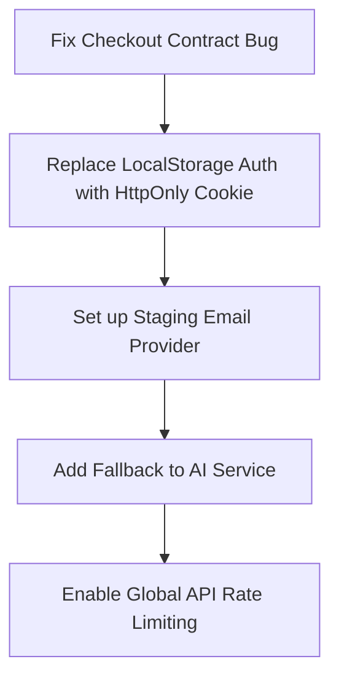

# Matgarco - Comprehensive Audit & Review Report (UPDATE_10)
**Date:** June 12, 2026  
**Auditor:** Antigravity (Senior Full-Stack Architect & Startup CTO)  
**Status:** Complete Audit Report  

---

## 📑 Executive Summary

**Matgarco** is a localized Egyptian SaaS e-commerce platform designed to allow local merchants to deploy online storefronts under custom subdomains, manage inventory, handle payments, and access AI-generated product content. 

This audit analyzes the codebase across six major modules:
1. **Backend API (`backend-node`)**
2. **Merchant Dashboard (`dashboard-react`)**
3. **Customer Storefront (`storefront-next`)**
4. **Landing Website (`landing-next`)**
5. **Super Admin Dashboard (`super-admin-react`)**
6. **AI Service (`ai-python`)**

We evaluate the platform through three distinct lenses:
*   🎓 **Graduation Project Final Defense:** Academic rigor, database schema design, security practices, and architectural decisions.
*   🚀 **Beta Launch Readiness:** Functional completeness, reliability, critical bugs, checkout flows, and payment gateway configurations.
*   💼 **Future Startup Investment (VC-Ready):** Scalability, business model viability, billing/commission aggregators, localization, and financial telemetry.

---

## 🎓 1. Graduation Project Final Defense Perspective
*Academic rigor, documentation integrity, and architectural validity.*

### 1.1 Architectural Decisions & Multi-Tenancy
*   **The Choice:** Shared Database + Shared Collections + Logical Tenant Isolation (using a `merchantId` field on all tenant-specific documents).
*   **Defense Justification:** 
    *   **Cost Effectiveness:** Using a single MongoDB Atlas instance (shared connections) dramatically reduces infrastructure costs, making the platform affordable for early-stage bootstrapping.
    *   **Operational Simplicity:** Database migrations, backups, and schema updates are applied globally rather than maintaining hundreds of separate databases.
    *   **Development Speed:** Easier cross-tenant queries for global platform analytics (Super Admin KPIs).
*   **Brutal Reality / Weakness:** 
    *   **No Physical Isolation:** If a developer forgets to apply the `tenantIsolation` middleware on a route, data leakage between merchants is highly probable. A compromised merchant owner account could potentially access database entries of other tenants if queries are not rigorously checked.

### 1.2 Database Schema & Mongoose Design
*   **Mongoose Indexing:** Mongoose schemas contain compound indexes (e.g. `merchantId` + `slug` or `merchantId` + `date` for analytics), which is excellent for query planning and performance.
*   **Audit Weakness:** Many models lack transaction-safety attributes. For example, during high-volume checkouts, decrementing stock without database locks leads to race conditions.
    *   *Good News:* The backend recently implemented atomic decrementing via `findOneAndUpdate` with a `$gte: item.quantity` check in `order.controller.ts`, which successfully prevents overselling. This is a solid point to highlight during the defense.

### 1.3 Security Review
*   **Authentication:** Dual-token JWT architecture (15m Access Token via Bearer header + 7d Refresh Token in an HttpOnly cookie) is modern and conforms to academic best practices.
*   **HMAC Signature Validation:** The Paymob webhook verification correctly enforces HMAC-SHA512 validation (`verifyPaymobHmac` in `payment.service.ts`). This is critical because skipping webhook signature validation allows attackers to spoof successful transactions and checkout for free.
*   **Defense Deficiencies (Critical):**
    1.  **Lack of Global Rate Limiting:** While `authLimiter` restricts brute-force attacks on the auth endpoints, the rest of the API has no global rate limiting. Attackers could easily scrape storefront products or DDoS the product controller.
    2.  **Hardcoded Credentials in Repository:** The `.env` file contains valid test secrets for Paymob, Cloudinary, and Qwen. For the defense and production, all credentials must be completely removed from the file system and injected via environment variables.

---

## 🚀 2. Beta Launch Readiness
*Reliability, functional gaps, and critical blockers before onboarded merchants go live.*

### 2.1 🚨 CRITICAL BLOCKER: Checkout Contract Mismatch
During our audit of the storefront checkout client (`storefront-next/src/app/store/[subdomain]/checkout/CheckoutClient.tsx`) and the backend order controller (`backend-node/src/controllers/order.controller.ts`), we identified a major contract mismatch that **completely breaks the checkout flow on the customer storefront**:

*   **Storefront Payload (Sends):**
    ```typescript
    customerInfo: {
      firstName: form.firstName,
      lastName: form.lastName,
      phone: form.phone,
      email: form.email,
    }
    ```
*   **Backend Controller Expectation (Validates):**
    ```typescript
    if (!customerInfo?.name) validationErrors.push('Customer name is required');
    ```
    And the backend expects `customerInfo.name` in the validation step, but later maps `firstName` and `lastName` when creating the Mongoose `Customer` record!
*   **The Bug:** Because the storefront does not send a `.name` property, checkout requests **always fail with a `400 Bad Request` ("Customer name is required")**, blocking COD and Card transactions.
*   **Resolution Needed:** Change the backend order controller to validate `firstName` and `lastName` instead of `name`.

### 2.2 Payment Gateway Readiness
*   **Payment Flow:** Integration with Paymob supports Card, Mobile Wallets, and Cash on Delivery (COD).
*   **The Aggregator vs Direct Merchant Key Split:**
    *   **Starter / Professional Plans:** Transactions are routed through the Matgarco platform Paymob account. Net merchant revenues are stored as a virtual balance (`payoutInfo.pendingBalance` in `Merchant.ts`) to be processed during weekly payouts.
    *   **Business Plan:** Merchants can hook up their own Paymob API keys (`paymobConfig.secretKey` / `publicKey`) to process transactions directly to their bank accounts.
*   **Missing Checkout UX:** If payment fails on the Paymob redirect, the user is sent back to the storefront. However, there is no mechanism to re-try paying for the *existing* order without refilling the entire cart and creating a new order.

### 2.3 Email & Notification Service
*   **Implementation Status:** While `email.service.ts` exists, it defaults to Nodemailer with mock Gmail configurations. 
*   **Beta Blocker:** A beta launch requires a professional transactional mailer integration (e.g. SendGrid, Mailgun, or Resend). Merchants and customers must receive reliable receipts, order updates, and password resets.

---

## 💼 3. Future Startup Investment (VC-Ready)
*Scalability, product market fit, financial telemetry, and business model robustness.*

### 3.1 Monetization & Financial Architecture
*   **SaaS Tiers:** Matgarco offers 4 tiers: Free Trial (14 days), Starter (250 EGP/mo), Professional (500 EGP/mo), and Business (1000 EGP/mo).
*   **Platform Commission:** 
    *   *Free Trial:* 3% platform commission + ~2% Paymob fee (Total 5% on online sales).
    *   *Starter:* 2% platform commission + ~2% Paymob fee (Total 4%).
    *   *Professional:* 1% platform commission + ~2% Paymob fee (Total 3%).
    *   *Business:* 0% platform commission (Merchants process transactions through their own Paymob credentials).
*   **Aggregator Math & Payout Status:** 
    *   The `payout.controller.ts` tracks pending payouts by aggregating paid orders where `usesMerchantPaymob: false` and `payoutStatus: 'pending'`.
    *   *VC Gap:* The system tracks `pendingBalance` but lacks automated transfers (e.g. Paymob payouts API or bank integrations). Platform administrators must run manual bank/InstaPay transfers and mark them as paid in the Super Admin dashboard.

### 3.2 Super Admin Telemetry & Mock Data Gaps
*   **The Dashboard:** Provides management for Merchants, Themes, Plans, Payouts, Support Tickets, and Platform Settings.
*   **VC Telemetry Gaps:** To raise investment, a SaaS platform needs real-time telemetry on **SaaS Unit Economics**:
    *   **MRR/ARR (Monthly/Annual Recurring Revenue):** Currently aggregated dynamically but needs snapshotting.
    *   **Churn Rate:** The percentage of merchants cancelling subscriptions month-over-month (not tracked dynamically).
    *   **LTV (Lifetime Value) & CAC (Customer Acquisition Cost):** Basic calculations are missing.
    *   *Recommendation:* Upgrade `super-admin-react` to fetch real financial reports instead of client-side mocks or simple database counts.

### 3.3 Theme Customization Engine
*   **The Good:** Section-based page builder. Homepage layouts are stored as JSON section trees under `theme.pages.home.sections`. This follows the Shopify theme engine pattern.
*   **The Bad (Beta/VC Bottleneck):** All 6 templates (Spark, Volt, Épure, Bloom, Noir, Mosaic) share the exact same HTML components under the hood, differentiated primarily by Tailwind classes, CSS custom properties (colors/radii), and Google Fonts. True storefront templates should allow structural variations.

### 3.4 AI Capabilities (AI Service - Python)
*   **The Good:** Built on FastAPI, calling Qwen API (DashScope) to generate high-quality Arabic descriptions, translation, and SEO metadata. Qwen is an excellent model choice for localized Egyptian startup audits as it has superb Arabic language comprehension and is highly cost-effective compared to OpenAI GPT models.
*   **The Bad:** The service depends completely on the active availability of a single external API key. If the DashScope API is blocked or runs out of credits, all merchants' AI features fail immediately.
    *   *Recommendation:* Implement a fallback mechanism to a local LLM (e.g. Ollama running Llama 3) or a backup provider (like Groq or OpenRouter).

---

## 🛠️ 4. Actionable Remediation Plan
*Steps to take immediate control of the code and fix the platform before launch.*



### Phase 1: High Priority (Immediate Fixes)
1.  **Resolve Storefront Checkout Bug:** In `backend-node/src/controllers/order.controller.ts` (Line 124), modify the validation block to check `customerInfo.firstName` and `customerInfo.lastName` instead of `customerInfo.name`.
2.  **Remove Hardcoded Secrets:** Migrate all values in `backend-node/.env` and `ai-python/.env` to secure environment variables, adding them to `.gitignore` and preparing template variables in `.env.example`.
3.  **Setup Resend/SendGrid:** Replace mock Nodemailer SMTP settings in `backend-node/src/services/email.service.ts` with a verified staging API client.

### Phase 2: Medium Priority (Security & Resilience)
1.  **Global Rate Limiting:** Apply `express-rate-limit` as a global Express middleware to protect against scraping and brute-force service exhaustion.
2.  **AI Service Fallback:** In `ai-python/services/qwen_client.py`, add try-catch wrappers that route requests to a secondary OpenAI or local Ollama client if the Qwen token expires.

### Phase 3: Long-term (VC & Business Polish)
1.  **Automate Payout Registry:** Integrate a webhook callback listener or a banking ledger that logs outgoing payout transactions automatically rather than purely manual record updates.
2.  **Telemetry snap-shots:** Implement a weekly CRON job on the backend to aggregate platform subscriptions, active merchant statistics, and transaction fees, storing them in an `Analytics` collection to power the Super Admin analytics graphs.
